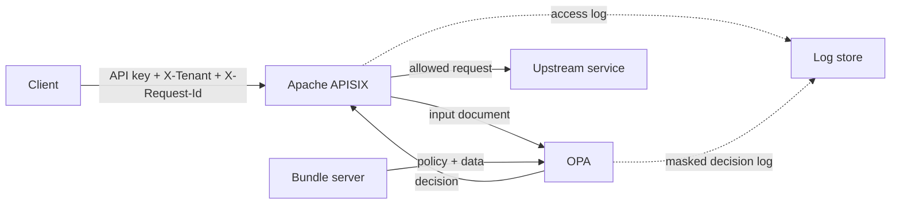

Putting an authorization check at an API gateway can make enforcement
consistent, but a working `allow` rule is only the beginning. The integration
also needs a stable input contract, deny-by-default policy, predictable failure
behavior, safe audit logs, and a policy-distribution model whose freshness is
understood.

This article develops those properties with Open Policy Agent (OPA) 1.19.0 and
Apache APISIX 3.17.0. The configuration and results below were validated with
these pinned versions. APISIX is the example policy caller; the design questions
apply to any gateway that asks OPA for a decision over HTTP.

## Draw the enforcement boundary first

The gateway is well placed to enforce facts visible at the edge: authenticated
caller identity, tenant, HTTP method, path, and coarse-grained permission.
Services should still enforce invariants that depend on domain state, such as
whether a user owns a particular invoice. The identity provider authenticates
the caller, APISIX constructs a policy input, OPA evaluates policy, and the
upstream handles an already-authorized request.



This boundary keeps policy ownership clear. Authentication runs before the OPA
plugin in this example. OPA decides whether the authenticated Consumer can perform
the operation for the supplied tenant.

## Treat the input as a versioned interface

APISIX sends an `input` document containing `request` and `var`. The request
includes the method, path, host, query parameters, and headers. Route, Service,
and Consumer objects are optional and disabled by default through
`with_route`, `with_service`, and `with_consumer`.

The policy needs the authenticated Consumer username, so the Route enables only
`with_consumer`:

```json
{
  "request-id": {},
  "key-auth": {},
  "opa": {
    "host": "http://opa:8181",
    "policy": "edge/authz/decision",
    "timeout": 500,
    "keepalive": true,
    "with_consumer": true
  }
}
```

More context is not automatically better. Every additional object enlarges the
policy interface and the data that may reach a decision log. During validation,
the APISIX 3.17.0 Consumer input included `auth_conf`, containing the active
credential configuration. That finding required an additional masking rule
before retaining decision logs.

Define which fields policy may use, test missing fields, and review the contract
when upgrading the gateway. If policy only needs a validated claim copied into
a dedicated header, a smaller input may be preferable to the entire Consumer
object. Never assume that an object named "consumer" contains identity metadata
only.

The contract should also define normalization. In this run, APISIX represented
the tenant header as `x-tenant`, while authentication added
`X-Consumer-Username` and `X-Credential-Identifier`. Rego should not depend on
accidental header spelling without a test fixture that matches the gateway's
observed JSON. The same rule applies to paths, query parameters, and identity:
choose one representation, capture a sanitized fixture, and review changes like
an API schema change.

## Make the decision total and deny by default

The policy maps authenticated usernames to roles and requires the `acme`
tenant. Readers may use GET; administrators may use GET or POST:

```rego
package edge.authz

import rego.v1

default allow := false

tenant := object.get(input.request.headers, "x-tenant", "")
role := object.get(data.edge_demo.roles, input.consumer.username, "")

allow if {
    tenant == "acme"
    role == "admin"
    input.request.method in {"GET", "POST"}
}

allow if {
    tenant == "acme"
    role == "reader"
    input.request.method == "GET"
}

reason := "request is not permitted by edge policy" if {
    not allow
}

reason := "" if {
    allow
}

decision := {"allow": allow, "reason": reason}
```

The role data used for this example is deliberately small:

```json
{
  "edge_demo": {
    "roles": {
      "admin": "admin",
      "reader": "reader"
    }
  }
}
```

The policy returns an empty reason on success, but the important
property is that `decision` is always defined and always contains `allow`.
APISIX queries `data.edge.authz.decision` and expects OPA's response to contain
`result`. An undefined rule is not the same as a defined denial.

Tests should cover both intended permissions and malformed inputs. With OPA
1.19.0, the validation run used the following non-writing format check, strict
validation, test, and bundle-build commands against its policy directory:

```shell
opa fmt --fail --list policy/
opa check --strict policy/
opa test -v policy/
opa build policy/authz.rego policy/mask.rego data.json -o edge-bundle.tar.gz
```

OPA 1.19.0 does not expose an `opa fmt --check` flag;
`--fail --list` provides the non-writing, non-zero-on-diff check used here.
The author's retained validation harness contains the policy tests and fixture
variants; it is not part of this content-only pull request. That run used eight
tests: reader read, reader write denial,
administrator read and write, unknown identity, missing tenant, malformed
input, and decision-log masking. All eight passed.

Exercise the exported decision rather than testing helper rules alone. A
refactor may change how roles or tenants are derived, but the exact document
queried by APISIX must remain defined and retain the same meaning.

Policy and data have different change patterns. The Rego module defines the
permission model; bundle data assigns identities to roles. Both are reviewed and
versioned, but changing data should not require editing the APISIX Route. This
separation is what the later bundle-update test verifies.

## Test failure behavior as part of the contract

Authorization failures are operational behavior, not implementation detail. The
APISIX 3.17.0 OPA plugin has three relevant branches:

- if no HTTP response is available from OPA, it blocks the request with 403;
- if the body is invalid JSON or lacks `result`, it returns 503;
- if a valid result has `allow: false`, it returns 403 unless policy supplies a
  different status.

Validate all three branches rather than inferring them from source code alone.
In the pinned run, stopping OPA produced 403. To exercise the client timeout
path deterministically, the plugin's decision HTTP request was directed to a
slow fault endpoint with a 100 ms plugin timeout; that case also produced 403.
Querying an undefined OPA path produced a response without `result`, which
APISIX reported as 503. Returning invalid JSON produced the same 503 boundary.

These codes have different meanings. A policy denial is an expected
authorization outcome. A 503 identifies a malformed or undefined decision
contract. An unreachable OPA is currently indistinguishable to the client from
a denial because the plugin blocks by default. Operators therefore need gateway
error logs and OPA health signals in addition to client metrics.

That distinction should appear in alerts. A rise in normal 403 policy denials
may indicate client behavior or an intentional policy change. Messages such as
`failed to process OPA decision`, `invalid response body`, or
`invalid OPA decision format` identify the integration path and need a
different response. Retain those APISIX error lines alongside the client-facing
status matrix so that the diagnosis does not infer root cause from an HTTP code
alone.

Fail-open may be appropriate for a narrowly scoped, low-risk endpoint, but it
is an architectural choice rather than a switch in this plugin. The tested
plugin has no configurable fail-open option. If an organization chooses a
different availability tradeoff, it should implement and threat-model that
path explicitly instead of describing the current integration as fail-open.

## Correlate logs without leaking credentials

OPA decision logs are valuable because they record the queried path, input,
result, bundle revision, metrics, and OPA `decision_id`. They can also record
secrets. Enable decision logging only after defining `data.system.log.mask`:

```rego
package system.log

import rego.v1

mask contains "/input/request/headers/apikey"
mask contains "/input/request/headers/authorization"
mask contains "/input/consumer/auth_conf"
mask contains "/input/consumer/plugins"
```

OPA evaluates this policy before emitting the event and records erased JSON
Pointers that exist in the input. In validation, a unit test supplied and
verified all four paths. The runtime input did not contain `consumer.plugins`,
so its decision event reported the other three paths in `erased`; OPA ignored
the absent JSON Pointer. A scan of the resulting logs found none of the seeded
API keys or Authorization value.

APISIX does not record OPA's `decision_id` in its access log in this
configuration. Instead, send a fixed `X-Request-Id`, include it in the APISIX
access-log format, and leave that non-secret header in OPA input.
The same value, `demo-correlation-001`, appears in both logs. This supports a
join without claiming that the gateway understands OPA's own decision
identifier.

Production masking should be derived from observed input, not copied blindly.
Seed recognizable synthetic secrets, exercise every authentication path, and
scan the resulting logs. Repeat that test after gateway or authentication
plugin upgrades.

Masking is not a substitute for minimization. Removing `auth_conf` at log time
protects the decision event, but OPA still received the field. If policy does not
need Consumer context, disable `with_consumer`. If it does, consider whether a
smaller authenticated identity value can be supplied through a trusted,
gateway-controlled header. Also review the decision result: reasons and response
headers can contain sensitive data just as inputs can.

The correlation ID has its own trust boundary. A client-provided value is useful
for a deterministic validation run, but a production gateway should validate or
generate it according to local rules and prevent ambiguous duplicates. The
property that matters is that one non-secret identifier is recorded consistently
on both sides.

## Keep bundle freshness separate from decision caching

To validate policy freshness, build two versioned revisions with `opa build`
and serve them from a static HTTP endpoint. OPA polls that endpoint every one
to two seconds:

```yaml
services:
  bundle:
    url: http://bundle-server

bundles:
  edge:
    service: bundle
    resource: bundles/edge.tar.gz
    polling:
      min_delay_seconds: 1
      max_delay_seconds: 2
```

Revision `v1` gives the reader role read-only access. Revision `v2` changes the
role data so the same authenticated reader can POST. The second decision
becomes active one second after publication without changing the APISIX Route.
That is an observation for this local configuration, not a propagation
guarantee.

The bundle server returns an ETag, and a conditional request with
`If-None-Match` receives 304. This avoids retransferring an unchanged snapshot.
It is bundle HTTP caching. APISIX `keepalive`, meanwhile, reuses the connection
to OPA. Neither mechanism caches an authorization decision. The changed bundle
affects the next evaluated request even though APISIX keepalive remains enabled.

For production, choose a polling window that balances freshness and service
load, monitor bundle activation, retain the last known good policy where
appropriate, and consider bundle signing. State the expected propagation
window in operational documentation.

Bundle rollout also needs a failure plan. Record the revision active on each OPA
instance, canary broad policy changes, and retain a known-good revision. Confirm
the application-facing decision instead of treating a successful upload or
download as proof of activation.

ETag behavior reduces unchanged transfers but does not make a fleet immediately
consistent. Different OPA instances may poll at different moments within their
configured windows. If a policy change must become effective everywhere before
another action occurs, periodic polling alone is not a coordination protocol;
the rollout process needs an explicit readiness condition.

## Production checklist

Before placing OPA authorization at an API edge:

- document the gateway-to-OPA input and decision schemas;
- send only the Route, Service, Consumer, headers, and claims policy requires;
- define a total decision with deny-by-default behavior;
- run strict checks and positive, negative, missing-field, and malformed-input
  tests;
- inject timeout, unavailable, invalid JSON, and undefined-decision failures;
- distinguish policy denials from integration failures in dashboards and logs;
- mask credentials using paths observed in real decision events;
- correlate gateway and OPA logs with a non-secret request identifier;
- monitor bundle revision and activation, and document the polling window;
- keep bundle transfer caching, connection reuse, and decision caching as
  separate concepts.

The important result is not that a gateway can call OPA. It is that the call has
a small contract, tested failure semantics, auditable but sanitized evidence,
and a policy-update path whose freshness is measurable.

## Validate the integration

Record both the request result and the relevant gateway or OPA log for each
case. The pinned validation run produced this matrix:

| Case                                                          | Expected observation                                       |
| ------------------------------------------------------------- | ---------------------------------------------------------- |
| Reader sends GET                                              | 200 from the upstream                                      |
| Reader sends POST                                             | 403 policy denial                                          |
| Administrator sends GET or POST                               | 200 from the upstream                                      |
| Identity is unknown, tenant is missing, or input is malformed | Defined denial                                             |
| OPA is stopped                                                | 403 with a gateway error log                               |
| Slow test endpoint exceeds the 100 ms plugin timeout          | 403 with a gateway error log                               |
| OPA returns invalid JSON or no `result`                       | 503 with a gateway error log                               |
| Bundle changes from `v1` to `v2`                              | The next decision changes without editing the APISIX Route |
| The same `X-Request-Id` is sent through both systems          | The identifier appears in both sanitized logs              |

Also verify that a conditional bundle request receives 304 when the snapshot is
unchanged and scan the retained logs for seeded credentials. In this run, the
bundle change became active after one second within the configured one-to-two
second polling window. This is a local observation, not a latency guarantee. No
throughput or latency benchmark was performed.

For implementation details, see the
[APISIX OPA plugin documentation](https://apisix.apache.org/docs/apisix/plugins/opa/),
OPA's [decision-log masking documentation](/docs/management-decision-logs), and
OPA's [bundle management documentation](/docs/management-bundles).
