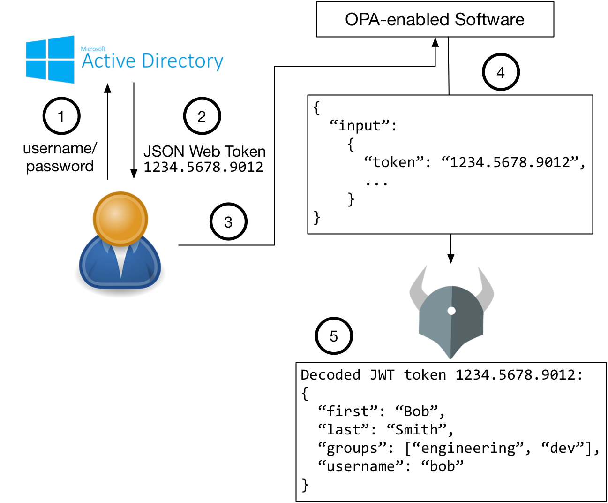
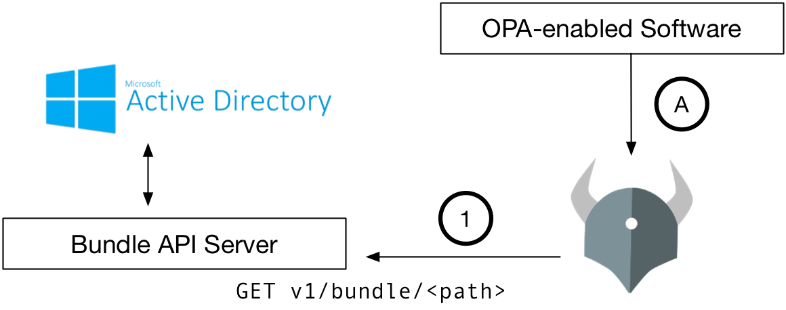
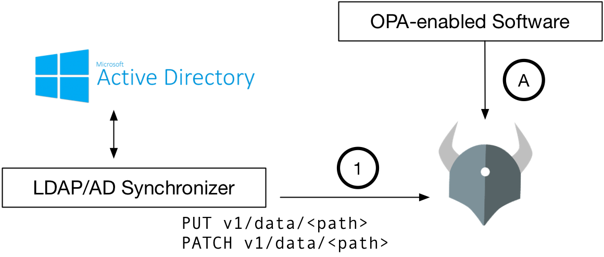
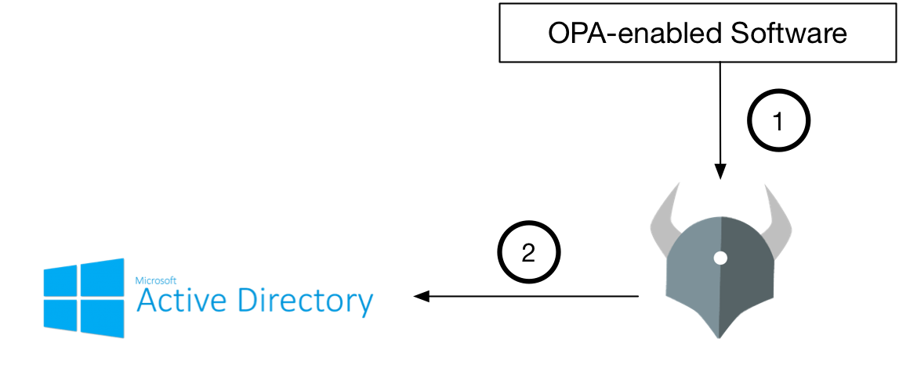

# Best Practices: Identity and User Attributes

A common question from OPA users is how to deal with identity and user attributes.  The first thing to keep in mind is that **OPA does not handle authentication**.  It does not help users prove they are who they say they are; it does not handle usernames and passwords, or issue TLS certificates.  OPA assumes you have authentication in place and helps you with the step after that: authorization and policy--controlling who can do what.

Of course, identity and user attribute information is crucial to answering who can do what.  In fact, whenever possible you should write policy in terms of user attributes (e.g. group membership) instead of individual users.  Otherwise, policies become brittle and require updates everytime an individual (or software system) joins or leaves the organization.  For example, you might grant higher privileges to people in engineering and currently on-call; then independently you can modify people's attributes without having to change policy.

To evaluate policies written using user attributes, OPA needs a way to figure out what the appropriate user attributes for each decision it makes.  Often those user attributes are stored in LDAP or ActiveDirectory (AD).  This document describes best-practices for providing LDAP/AD information to OPA.

Below we detail different ways to make LDAP/AD information available to OPA.  You should prefer earlier options in the list to later options, but in the end the right choice depends on your situation.

## 1. JWT Tokens

[JSON Web Tokens (JWTs)](https://tools.ietf.org/html/rfc7519) allow you to securely transmit JSON data between software systems and are often produced during the authentication process.  You can set up authentication so that when the user logs in you create a JWT with that user's LDAP/AD data.  Then you hand that JWT to OPA and use OPA's specialized support for JWTs to extract the information you need to make a policy decision.

### Flow
The following diagram shows this process in more detail.
1. User logs in to LDAP/AD
1. The user is given a JWT token encoding group membership and other user attributes that are stored in LDAP/AD
1. The user provides that JWT token to an OPA-enabled software system for authentication
1. The OPA-enabled software system includes that token as part of the usual `input` to OPA.
1. OPA decodes the JWT token and uses the contents to make policy decisions.

### Updates
The JWT only gets refreshed when the user authenticates; how often that happens is up to the TTL included in the token.  When LDAP/AD information changes, those changes will not be seen by OPA until the user authenticates and gets a new JWT.

### Size Limitations
JWTs have a limited size in practice, so if your organization has too many user attributes you may not be able to fit all the required information into a JWT.

### Security
* OPA includes primitives to verify the signature of JWT tokens.
* OPA let's you check the TTL.
* OPA has early support for making HTTP requests during evaluation, which could be used to check if a JWT has been revoked.  Though if you're connecting to a remote system on every policy decision anyway, you should think about whether connecting to LDAP/AD directly is more appropriate (see below).

## 2. Downloading LDAP/AD data as part of a policy bundle

JWTs may not be available to you.  Or perhaps your policies require information about a user other than the one performing the action that OPA is authorizing.

For example, suppose your policy says a resource's owner or anyone in the owner's group may modify that resource.  When Alice tries to modify a resource she doesn't own, OPA would need to find the owner and check if Alice belongs to the same group as the owner.  But if OPA only has Alice's JWT token, it does not know what groups the resource's owner belong to.

In any case, another option is to replicate LDAP/AD data in bulk into OPA.  One way to do that is through OPA's bundle feature, which periodically downloads policy bundles from a centralized server.  Those bundles can include data as well as policy.  If you implement the centralized server, you can include LDAP/AD data within the bundle.  Then every time OPA gets updated policies, it gets updated LDAP/AD data too.

### Flow
Two things happen independently with this kind of LDAP/AD integration.
* (1) OPA downloads new policy bundles including LDAP/AD
* (A) OPA-enabled software system asks OPA for policy decisions

### Updates
The lag between an LDAP/AD update and OPA having the update is the sum of the lag for an update between LDAP/AD and the central server and the lag for an update between the central server an OPA.  So if LDAP/AD updates every 5 minutes, and OPA pulls an update every 2 minutes, then the total maximum lag is 7 minutes.  Unlike the JWT case, it is feasible that a user could perform an action requiring authorization on the OPA-enabled service before OPA has the appropriate LDAP/AD policy, but you can account for that when writing policy and reject any request when there is insufficient data.

### Size limitations
Unlike the JWT case, where OPA only stores 1 user's LDAP/AD data at a time, when synchronizing LDAP/AD, OPA stores all users' LDAP/AD data at once in memory.  Obviously this can be a problem with large LDAP/AD stores.  Because the centralized server handles both policy and data it could provide just the LDAP/AD data necessary for the policies.

<!-- **Security**
* Don't expose OPA's API except through localhost
* Assuming LDAP/AD is the only context needed, use OPA's authentication/authorization to disable all of OPA's APIs except those needed by the OPA-enabled service. -->

## 3. Pushing LDAP/AD into OPA

Another way to replicate LDAP/AD data into OPA is to use OPA's API for injecting arbitrary JSON data.  You can build a synchronizer that pulls information out of LDAP/AD and pushes that information in OPA through its API.  This approach would be useful if you are not using the bundle API, or you need to optimize for update latency.

### Flow

Two things happen independently with this kind of LDAP/AD integration.
* (1) Synchronizer keeps OPA up to date with LDAP/AD
* (A) OPA-enabled software system asks OPA for policy decisions

### Updates

The total lag between LDAP/AD being updated and OPA being updated is the sum of the lag for an update between LDAP/AD and the synchronizer plus the lag for an update between the synchronizer and OPA.  Unlike the JWT case, it is feasible that a user could perform an action requiring authorization on the OPA-enabled service before OPA has the appropriate LDAP/AD policy, but you can account for that when writing policy and reject any request when there is insufficient data.

### Size limitations
Unlike the JWT case, where OPA only stores 1 user's LDAP/AD data at a time, when synchronizing LDAP/AD, OPA stores all users' LDAP/AD data at once in memory.  Obviously this can be a problem with large LDAP/AD stores.

<!--
**Security**
* Use mutual TLS to ensure only the synchronizer can use OPA's API to change the LDAP/AD data.
* Ensure OPA's policy rejects requests without sufficient data so that an OPA restart that wipes out memory does not leave the OPA-enabled service vulnerable. -->

## 4. Pull from LDAP/AD during evaluation

OPA has experimental capabilities for reaching out to external servers during evaluation.  This functionality handles those cases where there is too much data to synchronize into OPA, JWTs are ineffective, or policy requires information that must be as up to date as possible.

That functionality is implemented as [OPA builtins](https://openpolicyagent.org/docs/).  Check the docs for the latest instructions.

### Current limitations
* Unit test framework does not allow you to mock out the results of builtin functions
* Any credentials that are needed for the external service must be hardcoded into the policy.
  * There has been discussion around adding a builtin that pulls information out of the environment so that OPA can be configured with credentials.

### Flow
The key difference here is that every decision requires contacting LDAP/AD.  If that service or the network connection is slow or unavailable, OPA may not be able to return a decision.
1. OPA-enabled service asks OPA for a decision
1. OPA during evaluation asks LDAP/AD for user attributes

### Updates
LDAP/AD data is perfectly fresh.  There is no lag between an update to LDAP/AD and when OPA sees that update.

### Size limitations
Only the data actually needed by the policy is pulled from LDAP/AD.  There is no need for a synchronizer to figure out what data the policy will need before execution. It is possible to gather multiple users' attributes

### Performance and Availability
Latency and availability of decision-making are dependent on the network.  This approach may still be superior to running OPA on a remote server entirely because a local OPA can make some decisions without going over the network--those decisions that do not require information from the remote LDAP/AD server.

## 5. Summary

| Approach | Perf/Avail | Notes |
| -------- | ---------- | ----- |
| JWT | High | Updates only when user logs back in |
| Bundle | High | Updates to policy/data at the same time.  Size an issue. |
| Push | High | Control data refresh rate.  Size an issue. |
| Pull during eval | Dependent on network | Perfectly up to date.  No size limit. |

