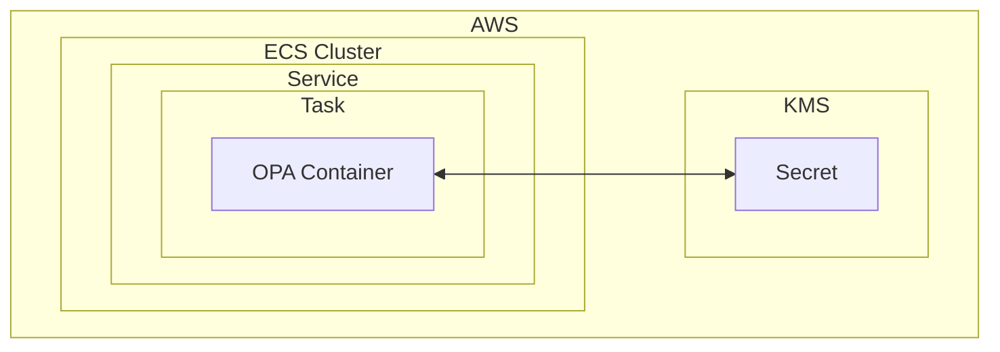

<!-- Manual Heading imports are needed because the ParamProvider plugin provider hides anchors from the broken link checker -->
import Heading from '@theme/Heading';

Amazon ECS (Elastic Container Service) is a managed platform for running
containerized applications. Software already packaged as containers, like OPA,
is easy to run on ECS. ECS takes care of scaling, networking, and
infrastructure, allowing you to focus on building and integrating your
applications.

ECS is great for hosting a centralized OPA, Policy Decision Point (PDP) service
to be accessed by Policy Enforcement Points (PEPs, e.g. business apps and
services) running elsewhere in your environment. ECS also supports running OPA
as a
[daemon](https://docs.aws.amazon.com/AmazonECS/latest/developerguide/ecs_services.html?icmpid=docs_ecs_hp-deploy-serviceType#service_scheduler_daemon)
or additional container alongside your other application containers too but this
pattern is not covered here.

This guide will explain the steps and key considerations for deploying an OPA
service using ECS.

## Supplying Configuration to OPA

While the default OPA configuration is simple, OPA has many different options
and settings. Like many other tools, OPA is commonly configured using a file
mounted into its container at a known path. There are many ways to configure OPA
on ECS:

- Loading a config file from S3 and using
  [environment variable substitution](../../configuration/#using-environment-variables-in-configuration) for secret values from KMS.
- Using [AWS AppConfig](https://docs.aws.amazon.com/appconfig/latest/userguide/what-is-appconfig.html)
  and the `aws-appconfig-agent` sidecar container to load the config file at
  start up.
- Using [command line flags](../../configuration/#setting-configuration-via-cli-arguments)
  to set values and not using a config file at all.

Since the preferred option is largely dependent on your organization's approach
to secrets management, we leave this exercise to the reader. The following guide
uses command line configuration with secrets loaded from KMS, to keep the
example simple to follow.

## Selecting or Creating an ECS Cluster

An ECS cluster is a logical grouping of Amazon Elastic Container Service (ECS)
resources used to run and manage Docker containers using AWS Fargate.

All applications running in ECS are part of an ECS cluster. When creating a
cluster for OPA, it's recommended to use the Fargate infrastructure type -
rather than EC2. Please see our [EC2 Guide](../aws/ec2) if you'd like
to run OPA on EC2.

Within our cluster, we will be running OPA using the following architecture:

<!-- markdownlint-disable MD044 -->
<!-- markdownlint-disable MD034 -->
<ParamProvider
  initialParams={{
    service: 'my-opa',
    region: 'us-east-1',
    secretARN: 'arn:aws:secretsmanager...',
    taskRoleArn: 'arn:aws:iam:...',
    version: '...',
  }}
>

<Heading as="h2" id="creating-a-secret-and-iam-role-for-your-opa-task">Creating a Secret and IAM Role for your OPA Task</Heading>

OPA needs to download policy at startup. Often credentials are needed to
download new policy and data bundles. These might be an API token, or
username/password combination depending on how your bundles are hosted.
These credentials must be securely stored. In this section, we’ll create a
secret in AWS Secrets Manager, an IAM policy to access the secret, and an IAM
role with that policy for the ECS task to use.

:::tip
Unsure how to authenticate OPA such that it can download bundles? Have a look at
the [configuration](../../configuration) documentation.

In this example we set an example `TOKEN` from the secret as an example using
[CLI flags](../../configuration#setting-configuration-via-cli-arguments).
:::

Create a secret with any variables you need such as `TOKEN` etc. Once you have
created the secret, note it's ARN here set it in the later
steps: <InlineEditable paramKey="secretARN"/>.
Create a IAM policy with the following rules to allow the OPA task to
access the secret:

<ParamCodeBlock>
{`
  {
    "Version": "2012-10-17",
    "Statement": [
      {
        "Effect": "Allow",
        "Action": "secretsmanager:GetSecretValue",
        "Resource": "{{secretARN}}
      }
    ]
  }
`}
</ParamCodeBlock>

Now you can create a new Role referencing this policy to use as the
`taskRoleArn` for the rest of the guide. When you have created the role, note
the task's ARN here to populate the later steps:
<InlineEditable paramKey="taskRoleArn"/>.

<Heading as="h2" id="creating-an-opa-task-definition">Creating an OPA Task Definition</Heading>

An ECS task definition is a blueprint that describes how containers
should run in AWS ECS, specifying details like container images, commands and
resource requirements. In this section, we will build a task definition for use
on ECS to run OPA.

Before continuing, please ensure you have set the following:

- Service Name: <InlineEditable paramKey="service"/> (This is the name for the
  service as it will appear in ECS)
- Secret ARN: <InlineEditable paramKey="secretARN"/> (if configuration depends
  on secret values for some variables)
- Region: <InlineEditable paramKey="region"/>
- OPA Version: <InlineEditable paramKey="version"/>, e.g. `X.Y.Z` not `latest`
  or `vX.Y.Z`. Review the
  [OPA images](https://hub.docker.com/r/openpolicyagent/opa/tags) for a list of
  available versions.

<!-- markdownlint-disable MD044 -->
<!-- markdownlint-disable MD034 -->
<ParamCodeBlock>
{`
{
    "family": "{{service}}",
    "containerDefinitions": [
        {
            "name": "opa",
            "image": "openpolicyagent/opa:{{version}}",
            "cpu": 0,
            "portMappings": [
                {
                    "name": "opa-8181-tcp",
                    "containerPort": 8181,
                    "hostPort": 8181,
                    "protocol": "tcp"
                }
            ],
            "essential": true,
            "command": [
                "--server",
                "--set",
                "\"default_decision=/http/example/authz/allow\"",
                "--set",
                "\"services.example_com.url=https://example.com/control-plane-api/v1\"",
                "--set",
                "\"services.example_com.credentials.bearer.token=\${TOKEN}\"",
            ],
            "healthCheck": {
              "command": [
                "CMD",
                "/opa",
                "eval",
                "-f", "pretty",
                "--fail",
                "200 = http.send({\"url\": \"http://localhost:8181/health\", \"method\": \"get\"}).status_code"
              ],
              "interval": 30,
              "timeout": 5,
              "retries": 2,
              "startPeriod": 10
            },
            "environment": [],
            "mountPoints": [],
            "volumesFrom": [],
            "secrets": [
                {
                    "name": "TOKEN",
                    "valueFrom": "{{secretARN}}:TOKEN::"
                },
            ],
            "logConfiguration": {
                "logDriver": "awslogs",
                "options": {
                    "awslogs-group": "/ecs/{{service}}",
                    "mode": "non-blocking",
                    "awslogs-create-group": "true",
                    "max-buffer-size": "25m",
                    "awslogs-region": "{{region}}",
                    "awslogs-stream-prefix": "ecs"
                }
            },
            "systemControls": []
        }
    ],
    "taskRoleArn": "{{taskRoleArn}}",
    "networkMode": "awsvpc",
    "volumes": [],
    "placementConstraints": [],
    "requiresCompatibilities": [
        "FARGATE"
    ],
    "cpu": "1024",
    "memory": "2048",
    "runtimePlatform": {
        "cpuArchitecture": "X86_64",
        "operatingSystemFamily": "LINUX"
    }
}
`}
</ParamCodeBlock>

:::warning
If you have configured OPA to use another port than `8181`, make sure to update
the health `localhost` port too.
:::

<Heading as="h2" id="deploying-opa-on-the-cluster">Deploying OPA on the Cluster</Heading>

Once you have a task definition in place, you can deploy it to your ECS cluster.

1. Create a new service in the cluster where you'd like to deploy OPA.
2. Use a `Service` as the `Application type`, OPA will be a long running
   service.
3. Select <InlineEditable paramKey="service"/> as the `Family` of task
   definitions.

Once the service is created, ECS will start a task using the task definition
and you should see the OPA is accessible shortly after.

</ParamProvider>

## Accessing the OPA service

There are many options to access the OPA service running on ECS from your PEPs.
The right option for your use case will depend on the location of OPA's callers
in your infrastructure - among other factors like security and performance. A
brief overview of some options is provided below.

- **Application Load Balancer (ALB)**: Well suited to OPA's REST API HTTP
  traffic, ALB operates at Layer 7 and supports advanced routing features. Use
  an ALB when you need to route requests to OPA based on URL paths or host
  headers or require integration with AWS services like AWS WAF.
- **Network Load Balancer (NLB)**: Best suited for high performance OPA use
  cases where response times are critical. Read more about
  [NLB integration with ECS](https://docs.aws.amazon.com/AmazonECS/latest/developerguide/nlb.html).
- **Service Discovery with AWS Cloud Map**: Allows internal clients within the
  same VPC to access the OPA service using DNS names. Opt for this when your OPA
  clients are inside your AWS network, and you want to avoid exposing services
  to the internet.
