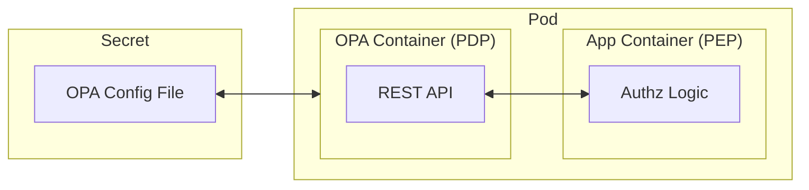
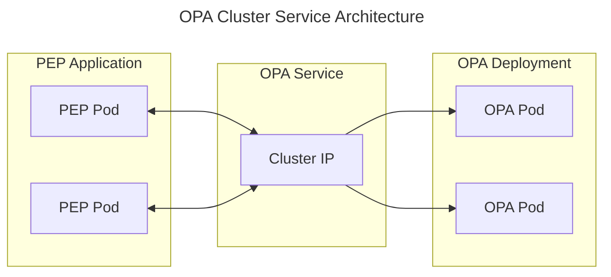

Kubernetes is a powerful, extensible platform for deploying containerized
applications. Running Open Policy Agent (OPA) as a Policy Decision Point (PDP)
on Kubernetes is a common approach for delivering fine-grained policy management
directly into containerized workloads enforcing policy decisions at runtime
(Policy Enforcement Points, PEPs).

This guide provides an overview of the various deployment patterns for OPA on
Kubernetes, from cluster to application-level deployments.

- **Sidecar (Application)**: When a Policy Enforcement Point (PEP) application
  needs low-latency policy decisions, OPA can be deployed as a sidecar to the
  application containers in the same pod. This pattern supports per-application
  OPA configuration, is network fault tolerant, and scales with the application.
- **Sidecar (Service Mesh)**:
  [`opa-envoy-plugin`](https://github.com/open-policy-agent/opa-envoy-plugin/tree/main)
  extends the OPA native API capabilities to support Envoy's
  [External authorization](https://www.envoyproxy.io/docs/envoy/latest/intro/arch_overview/security/ext_authz_filter.html)
  API. This allows OPA to be used to enforce L7 policy on requests before they
  event reach the application. In this use case, the PEP is the Envoy proxy,
  however OPA sidecar still exposes other APIs for local policy decisions as
  above.
- **Cluster Service**: Sometimes, running a cluster service is the best way to
  run OPA. In addition to responding to Kubernetes Admission Review requests,
  this deployment pattern supports PEPs applications sharing a highly available
  OPA PDP service. This can lead to higher latencies, and represent a single
  point of failure if misconfigured so take that into account when planning.
- **External Service**: Similar to a cluster service, running a cluster OPA PDP
  service behind a load balancer can be a good way to share OPA with other,
  out-of-cluster PEPs. This can be useful for applications running on other
  products or on-prem. The main consideration here is latency and network
  fault tolerance. Ensure to plan accordingly if going this route.
- **Cluster Daemonset**: Generally speaking, running OPA as a Daemonset is not
  recommended. This pattern can be hard to scale with applications and requires
  careful resource allocation. However, if you are running minimal pods per
  node, and are not able to use a sidecar, this may be a suitable alternative.

In this guide, we'll focus on the sidecar and cluster service patterns. See
below for links to [cloud provider](#cloud-providers) specific details.


## Configuring OPA Containers

Regardless of how OPA is running within your cluster, OPA needs configuration to
instruct it on: where to download policy from, how to log decisions and other
options. See the
[configuration documentation](../configuration/)
for more details.

In a Kubernetes environment, OPA can be configured using a `Secret` resource
mounted into the OPA container. This command can be used to see the Secret YAML
needed to create the secret:

```sh
kubectl create secret generic opa-config \
  --from-file=opa-config.yaml=opa-config.yaml \
  --dry-run=client -o yaml
```

The following examples will assume that in the namespace where OPA is running,
the `opa-config` secret will be installed. If replicating this secret to many
namespaces is proving tiresome, you can configure a tool like
[`kubernetes-replicator`](https://github.com/mittwald/kubernetes-replicator)
to automate the process.


## Running OPA as a Sidecar

In this section, we'll cover the process required to get OPA running as a
sidecar container in your application pods. This model is well-suited for
for most applications running in Kubernetes.

:::tip
Using Envoy or Istio? Check out
[`opa-envoy-plugin`](https://github.com/open-policy-agent/opa-envoy-plugin) which
implements Envoy's external authorization API.
:::

This diagram shows an OPA container running alongside an application container.
The application container is enforcing policy decisions made by OPA and queries
OPA for policy decisions over the
[REST API](../rest-api/). OPA is
loading its configuration file from the `Secret` created earlier.



A sidecar container is simply another container added to the Pod's
`spec.containers` list. When OPA is run in this way, it shares the same network
namespace as the application container and they can communicate with each other
on the loopback interface. OPA will be listening on port `8181` by default, but
feel free to change this if needed with the `--addr` flag.

<SideBySideContainer>
  <SideBySideColumn>
```yaml title="Before"
apiVersion: apps/v1
kind: Deployment
metadata:
  name: your-app
spec:
  replicas: 1
  selector:
    matchLabels:
      app: your-app
  template:
    metadata:
      labels:
        app: your-app
    spec:
      containers:
        - name: your-app-container
          image: your-app-image
          ports:
            - containerPort: 8080
```
  </SideBySideColumn>
  <SideBySideColumn>

```yaml title="After"
apiVersion: apps/v1
kind: Deployment
metadata:
  name: your-app
spec:
  replicas: 1
  selector:
    matchLabels:
      app: your-app
  template:
    metadata:
      labels:
        app: your-app
    spec:
      containers:
        - name: your-app-container
          image: your-app-image
          ports:
            - containerPort: 8080
// highlight-start
        - name: opa
          # use the version of a recent OPA release
          image: openpolicyagent/opa:${OPA_VERSION}
          args:
          - "run"
          - "--server"
          - "--addr=:8181"
          - "--config-file=/run/secrets/opa-config.yaml"
          ports:
            - containerPort: 8181
          volumeMounts:
            - name: opa-config
              mountPath: /run/secrets
              readOnly: true
      volumes:
        - name: opa-config
          secret:
            secretName: opa-config
// highlight-end
```
  </SideBySideColumn>
</SideBySideContainer>

Once this new version of the Deployment is applied, the OPA container will be
start alongside the application container and be available for policy decisions.
If using configuration as described above, OPA will download the
latest policy bundle from there and send all decisions back by default.


## Running OPA as a Cluster Service

OPA can also be deployed as a service on Kubernetes and invoked as a PDP by PEP
applications using using the cluster service hostname and pod network. This
deployment model is easily extended to a LoadBalancer service for external
PEPs too.

As outlined above, the sidecar pattern is preffered for most applications,
however this pattern is useful when a higher latency is tolerable or a _very_
large dataset is required to evaluate policy rules.




To run a replicated OPA service, you can start with the following Kubernetes
Deployment manifest. This deployment has the following features:

- Runs with 3 replicas. This number can be adjusted to suit your needs.
- Runs in a guaranteed service class with 1 CPU and 1Gi of memory. This again
  should be tuned to your needs.
- Loads the OPA configuration from the secret created above.
- Has health and liveness checks using the OPA `/health` endpoints.
- Uses pod anti-affinity to prefer that OPA pods are not scheduled on the same
  node.


```yaml
apiVersion: apps/v1
kind: Deployment
metadata:
  name: opa
spec:
  replicas: 3
  selector:
    matchLabels:
      app: opa
  template:
    metadata:
      labels:
        app: opa
    spec:
      affinity:
        podAntiAffinity:
          preferredDuringSchedulingIgnoredDuringExecution:
            - weight: 100
              podAffinityTerm:
                labelSelector:
                  matchLabels:
                    app: opa
                topologyKey: "kubernetes.io/hostname"
      containers:
        - name: opa
          image: openpolicyagent/opa:${OPA_VERSION}
          args:
          - "run"
          - "--server"
          - "--addr=:8181"
          - "--config-file=/run/secrets/opa-config.yaml"
          ports:
            - containerPort: 8181
          resources:
            requests:
              memory: "1Gi"
              cpu: "1"
            limits:
              memory: "1Gi"
              cpu: "1"
          livenessProbe:
            httpGet:
              path: /health/live
              port: 8181
            initialDelaySeconds: 10
            periodSeconds: 5
          readinessProbe:
            httpGet:
              path: /health/ready
              port: 8181
            initialDelaySeconds: 10
            periodSeconds: 5
          volumeMounts:
            - name: opa-config
              mountPath: /run/secrets
              readOnly: true
      volumes:
        - name: opa-config
          secret:
            secretName: opa-config
```

This deployment could be targeted with a Service resource like the one below.
This exposes the same port, `8181` from the deployment. Feel free to re-map this
if callers need to use a different port. See the
[Cloud Providers](#cloud-providers) docs below for more details on how to
configure load balancers for external access.

```yaml
apiVersion: v1
kind: Service
metadata:
  name: opa
spec:
  selector:
    app: opa
  ports:
    - protocol: TCP
      port: 8181
      targetPort: 8181
  type: ClusterIP
```

This is not a requirement, but if your traffic to the OPA service is not
expected to be uniform, you can also add use a HorizontalPodAutoscaler to
control the number of running instances. It's suggested that you start by
scaling based on CPU utilization, but this should be adjusted based on your
load and use case.

```yaml
apiVersion: autoscaling/v2
kind: HorizontalPodAutoscaler
metadata:
  name: opa
spec:
  scaleTargetRef:
    apiVersion: apps/v1
    kind: Deployment
    name: opa
  minReplicas: 3
  maxReplicas: 10
  metrics:
    - type: Resource
      resource:
        name: cpu
        target:
          type: Utilization
          averageUtilization: 50
```


## Cloud Providers

View the pages below for cloud provider-specific deployment notes. These pages
details where there are differences or additions to the above content.

<CardGrid>
  <Card key={"aws"} item={{
    title: "EKS",
    icon: require('../assets/images/aws/eks.png').default,
    link: "../deploy/aws/eks",
    link_text: "Deploy on EKS",
  }} />
  <Card key={"google-cloud"} item={{
    title: "GKE",
    icon: require('../assets/images/google-cloud/gke.png').default,
    link: "../deploy/google-cloud/gke",
    link_text: "Deploy on GKE",
  }} />
  <Card key={"azure"} item={{
    title: "AKS",
    icon: require('../assets/images/azure/aks.png').default,
    link: "../deploy/azure/aks",
    link_text: "Deploy on AKS",
  }} />
</CardGrid>


## Further Reading

- [Kubernetes Tutorial](../kubernetes)
- [Envoy on openpolicyagent.org](../envoy)
