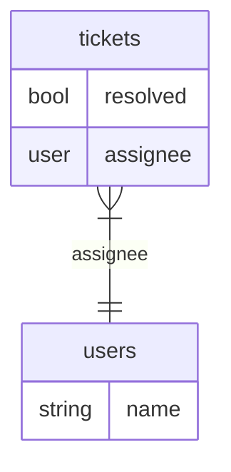

Column masking rules in Rego are used to generate an object that specifies exactly how an application should handle masking particular columns returned by the database.

:::info What you will learn
You will develop an intuition for what valid masking rules look like, and how to build default-deny and default-allow masking policies.
:::


### What is Column Masking?

For our data filtering use case, a row might be returned from the database that has a sensitive column present.
We still want the application to be able to display everything it can to the user, but ideally hiding or modifying the sensitive values before display.


## Format of a Column Masks Object

The column masks are structured as a nested object, with the structure:

```json
{
  "<TABLE>": {
    "<COLUMN>": {
      "replace": {
        "value": "example_value_here"
      }
    }
  }
}
```

:::note Why only replacing values?
Currently, only the `replace` masking function is supported, but other options may be added in the future.
:::

Multiple tables and columns can be present simultaneously.
Here is a more complex example:

```json
{
  "users": {
    "id": {
      "replace": {
        "value": "<id>"
      }
    },
    "email": {}
  },
  "tickets": {
    "description": {
      "replace": {
        "value": "***"
      }
    }
  }
}
```

In the above example, `users.id` and `tickets.description` will be replaced with `"<id>"` and `"***"`, respectively, but `users.email` will be displayed normally.

:::note No masking function means show value
Note that the value keyed under `users.id` is **empty**, which implies "show value". This can be useful in default-deny masking policies to allow a column through under certain conditions.
:::


## Creating a default-deny style masking policy

For our running example, we will be adding column masking to a support ticket application, where the fields of a tickets that a user can see is determined by their role.

Our masking policy will mask the `tickets.description` field with the dummy value `"<description>"` by default, and will allow the real value through for users with the `admin` role.

Roles are provided to EOPA via `roles/data.json`, and the SQL tables contain tickets and assignees.



import Tabs from '@theme/Tabs';
import TabItem from '@theme/TabItem';

We will be generating data filters and column masks for the `data.filters.include` rule, which marks `data.filters.masks` as its masking rule with the `custom.mask_rule` key, as shown below.

<Tabs>
<TabItem value="rego" label="filters.rego" default>

```rego
package filters

import rego.v1

# METADATA
# scope: document
# description: Return all rows, for sake of the example.
# compile:
#   unknowns: ["input.tickets"]
#   mask_rule: data.filters.masks
default include := true

# Mask all ticket descriptions by default.
default masks.tickets.description.replace.value := "<description>"

# Allow viewing the description if the user is an admin.
masks.tickets.description.replace.value := {} if {
  "admin" in data.roles[input.tenant][input.user]
}
```
</TabItem>
<TabItem value="data" label="roles/data.json">

```rego
{
  "alice": ["admin"],
  "bob": ["reader"],
  "ceasar": ["resolver"]
}
```
</TabItem>
</Tabs>


### Reader role

A Reader should be able to only see the masked value for the `tickets.description` field, because they are not an Admin, and so they get the default rule's result.

```http title="Request"
POST /v1/compile/filters/include
Content-Type: application/json
Accept: application/vnd.opa.ucast.all+json

{
  "input": {
    "user": "bob",
    "action": "list"
  }
}
```

```http title="Response"
HTTP/1.1 200 OK
Content-Type: application/json

{
  "result": {
    "query": {},
    "masks": {
      "tickets": {
        "description": {
          "replace": {
            "value": "<description>"
          }
        }
      }
    }
  }
}
```


### Admin Role

An Admin should be able to see every field of every ticket, since their role triggers a dedicated rule body that removes the masking function.

```http title="Request"
POST /v1/compile/filters/include
Content-Type: application/json
Accept: application/vnd.opa.ucast.all+json

{
  "input": {
    "user": "alice",
    "action": "list"
  }
}
```

```http title="Response"
HTTP/1.1 200 OK
Content-Type: application/json

{
  "result": {
    "query": {},
    "masks": {
      "tickets": {
        "description": {}
      }
    }
  }
}
```


## Creating a default-allow style masking policy

For this example, we will keep the support ticket application setup from before. We are still limiting which fields of a tickets that a user can see, based on their role.

Our masking policy will allow the real value through all roles _except_ the `reader` role. The `reader` role will see the every `tickets.description` field set to `"<description>"`.

<Tabs>
<TabItem value="rego" label="filters.rego" default>

```rego
package filters

import rego.v1

# METADATA
# scope: document
# description: Return all rows, for sake of the example.
# compile:
#   unknowns: ["input.tickets"]
#   mask_rule: data.filters.masks
default include := true

# Mask the description field if the user is a Reader.
masks.tickets.description.replace.value := "<description>" if {
  "reader" in data.roles[input.tenant][input.user]
}
```
</TabItem>
<TabItem value="data" label="roles/data.json">

```rego
{
  "alice": ["admin"],
  "bob": ["reader"],
  "ceasar": ["resolver"]
}
```
</TabItem>
</Tabs>


### Reader role

A Reader should see the masked value for the `tickets.description` field.

```http title="Request"
POST /v1/compile/filters/include
Content-Type: application/json
Accept: application/vnd.opa.ucast.all+json

{
  "input": {
    "user": "bob",
    "action": "list"
  }
}
```

```http title="Response"
HTTP/1.1 200 OK
Content-Type: application/json

{
  "result": {
    "query": {},
    "masks": {
      "tickets": {
        "description": {
          "replace": {
            "value": "<description>"
          }
        }
      }
    }
  }
}
```


### Resolver Role

A Resolver should be able to see every field of every ticket, since they're not one of the targeted roles.

```http title="Request"
POST /v1/compile/filters/include
Content-Type: application/json
Accept: application/vnd.opa.ucast.all+json

{
  "input": {
    "user": "caesar",
    "action": "list"
  }
}
```

```http title="Response"
HTTP/1.1 200 OK
Content-Type: application/json

{
  "result": {
    "query": {},
    "masks": {
      "tickets": {
        "description": {}
      }
    }
  }
}
```
