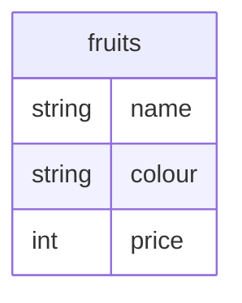

import SideBySideContainer from '@site/src/components/SideBySide/Container';
import SideBySideColumn from '@site/src/components/SideBySide/Column';

To be able to use Rego for data filtering, the policy needs to be constructed to

1. correctly represent the desired row filtering logic
2. properly be **translatable into the target representation** (such as SQL)

The subset of Rego that can be used to represent row filtering logic is colloquially referred to as the **fragment**.

:::info What you will learn
You will develop an intuition for what is valid Rego for data filters depending on the target.
Not every construct is supported for every target.

For a step-by-step walkthrough of evaluating a Rego policy _partially_, see [Evaluating a data filter policy](./partial-evaluation).
:::


### What is Partial Evaluation?

The translation of data policies into queries (like SQL WHERE clauses) is driven by _partial evaluation (PE)_ of a Rego query.

> With partial evaluation, callers specify that certain inputs or pieces of data are _unknown_. OPA evaluates as much of the policy as possible without touching parts that depend on unknown values.<sup>[1](https://blog.openpolicyagent.org/partial-evaluation-162750eaf422)</sup>

The _unknown_ values that remain during partial evaluation represent the pieces of data that represent your filter.

:::tip
When only _known_ values are used, **you can use all of Rego.**
:::


## Example Preamble

In our running example, we'll assume a table `fruits` with columns `name`, `colour`, and `price`. These **unknown values** are represented with `input.<TABLE>.<COLUMN>` e.g. `input.fruits.name`



Our data filters also depend on user information. These **known values** are represented with `input.user`

```json
{
  "name": "april",
  "email": "april@corp.com",
  "fav_colour": "yellow",
  "budget": 10
}
```


## Simple comparisons

The fragment supports simple comparisons, such as `==`, `!=`, `<`, `>`, `<=`, `>=`, between _unknown_ and _known_ values.
It is not important if the _unknown_ is on the left-hand side ("LHS") or right-hand side ("RHS"), but it is critical that only one side is _unknown_:

:::tip OK
```rego
package filters

include if {
	input.fruits.name == "banana"                # LHS unknown, RHS constant
	input.fruits.price <= input.user.budget      # LHS unknown, RHS known.
	input.user.fav_colour == input.fruits.colour # LHS known, RHS unknown.
}
```

SQL target: `WHERE name = 'banana' AND price <= 10 AND colour = 'yellow'`

As you can see the _known_ values from `input.user` have been replaced.
:::

:::danger NOT OK
```rego
package filters

include if {
	input.fruits.name != input.fruits.colour # LHS and RHS unknown
	input.fruits.price                       # plain unknown
}
```
:::

:::info SQL
For SQL translation targets, it's possible to have unknowns on both sides of the simple comparisons.

```rego
package filters

include if input.fruits.name != input.fruits.colour
```
SQL target: `WHERE name <> colour`
:::


## Built-in Functions

Certain built-in functions can be translated with certain restrictions:

- `startswith`
- `endswith`
- `contains`
- `k in ...` (not `k, v in ...`)

These built-in functions can only be used with _unknowns_ on the left-hand side.

:::tip OK
```rego
package filters

include if {
	startswith(input.fruits.name, "ba")
	input.fruits.colour in {"blue", "green"}
}
```

SQL target: `WHERE name LIKE 'ba%' AND colour IN ('blue', 'green')`.
:::

:::danger NOT OK
```rego
package filters

include if {
	endswith("apple", input.fruits.name)        # RHS unknown
	1, input.fruits.colour in ["blue", "green"] # k, v in ...
	regexp.match(input.fruits.name, '^b[an]+$') # unsupported builtin (for unknown values)
}
```
:::

Other built-in functions are not supported **for usage with _unknown_ values**.
If your filtering rules use other built-ins with _known values_, that's OK -- see below for an example.


## Rules and functions

Many Rego constructs are available for building filters, with certain restrictions:

1. `every` may not be used with _unknown_ values
2. `default` rules (or functions) may not be used in combination with _unknown_ values

Nonetheless, you can use rules and functions to structure your policy, as long as these restrictions are observed:

:::tip OK
```rego
package filters

include if user_in_corp

include if {
	not user_in_corp
	apple_ish
}

# apple_ish rule does not use `default` or `every`
apple_ish if input.fruits.name == "pineapple"
apple_ish if input.fruits.name == "apple"

# user_in_corp only uses known values
default user_in_corp := false
user_in_corp if endswith(lower(input.user.email), "@corp.com")
```

SQL target: `WHERE name = 'pineapple'` if the user's email is not ending in `@corp.com`. If it does, the filter would be empty, not restricting the database query.
:::

:::danger NOT OK
```rego
package filters

include if only_pineapples

default only_pineapples := false                    # default rule
only_pineapples if input.fruits.name == "pineapple"
```
:::


## `not` expressions

Expressions using `not` are permitted for [simple expressions](#simple-comparisons) and [built-in functions](#built-in-functions).
`not` combined with a _unknown_ value or a rule reference is not allowed.
:::tip OK
```rego
package filters

include if {
	not input.fruits.name == "apple"
	not input.fruits.colour in {"blue", "green"}
}
```

SQL target: `WHERE (NOT name = 'apple' AND NOT colour IN ('blue', 'green'))`.
:::

:::danger NOT OK
```rego
package filters

include if not input.fruits.name                    # plain unknown

include if not apple_ish                            # not + rule
apple_ish if endswith(input.fruits.name, "apple")
apple_ish if startswith(input.fruits.name, "apple")
```
:::
