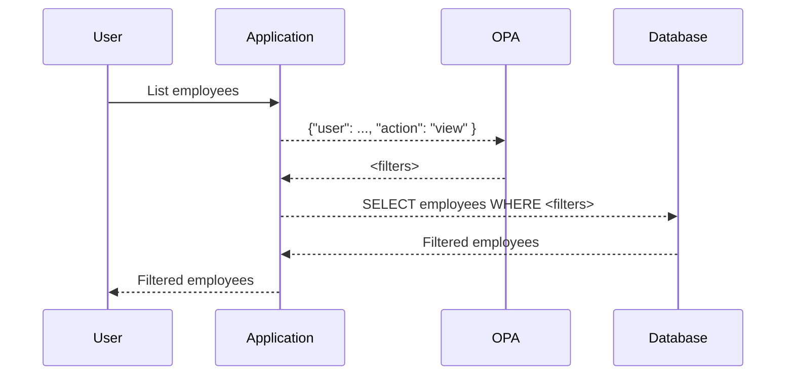

Data Filtering is a common use case for authorization that goes beyond "allow or deny?".
It is often related to searching (or listing) multiple entities.
Here, we start with a problem exposition before going into the details of data filtering with OPA in the next sections.

## Evaluation vs Search

**Authorization evaluation** questions ask "Can `subject` do `action` to `resource` (with `context`)?", e.g.

- Can _Sally_ (`subject`) _withdraw_ (`action`) _$5,000_ (`context`) from _account 058201_ (`resource`)?

The response to this is **allow** or **deny**.

**Authorization search** questions ask which values of an unknown generate an allow or deny decision, e.g.:

- Unknown **Actions**: What actions can Javier do on an escalated ticket?
- Unknown **Context**: During what hours can badge #2541 access the store room?
- Unknown **Subject**: Who is allowed to approve payments over $10,000?
- Unknown **Resource**: Whose salaries can a Director see?

The response to this is a **set of filtered application data**.

