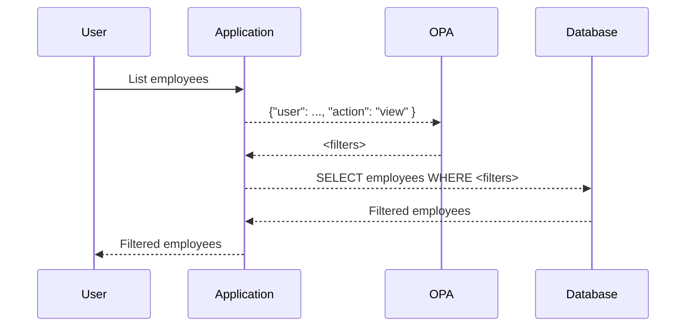

Data Filtering is a common use case for authorization that goes beyond "allow or deny?".
It is often related to searching (or listing) multiple entities.
Here, we start with a problem exposition before going into the details of data filtering with OPA in the next sections.

## Evaluation vs Search

**Authorization evaluation** questions ask "Can `subject` do `action` to `resource` (with `context`)?", e.g.

- Can _Sally_ (`subject`) _withdraw_ (`action`) _$5,000_ (`context`) from _account 058201_ (`resource`)?

The response to this is **allow** or **deny**.

**Authorization search** questions ask which values of an unknown generate an allow or deny decision, e.g.:

- Unknown **Actions**: What actions can Javier do on an escalated ticket?
- Unknown **Context**: During what hours can badge #2541 access the store room?
- Unknown **Subject**: Who is allowed to approve payments over $10,000?
- Unknown **Resource**: Whose salaries can a Director see?

The response to this is a **set of filtered application data**.


```mermaid
sequenceDiagram
    User->>Application: List employees
    Application-->>OPA: {"user": ..., "action": "view" }
    OPA-->>Application: <filters>
    Application-->>Database: SELECT employees WHERE <filters>
    Database-->>Application: Filtered employees
    Application-->>User: Filtered employees
```

## A quick example

Consider an `employees` database table with salary information. The question is: **whose salaries can a Director see?**

The rule is: Directors may see the salaries of employees in their own department. When Alice (Engineering Director) lists employees, the highlighted rows are what she should see:

<table>
  <thead>
    <tr><th>name</th><th>department</th><th>role</th><th>salary</th></tr>
  </thead>
  <tbody>
    <tr style={{backgroundColor: 'var(--ifm-color-warning-contrast-background)'}}><td>Alice</td><td>engineering</td><td>director</td><td>130000</td></tr>
    <tr style={{backgroundColor: 'var(--ifm-color-warning-contrast-background)'}}><td>Bob</td><td>engineering</td><td>engineer</td><td>90000</td></tr>
    <tr style={{backgroundColor: 'var(--ifm-color-warning-contrast-background)'}}><td>Carol</td><td>engineering</td><td>engineer</td><td>85000</td></tr>
    <tr style={{backgroundColor: 'transparent'}}><td>Dave</td><td>marketing</td><td>director</td><td>120000</td></tr>
    <tr style={{backgroundColor: 'transparent'}}><td>Eve</td><td>marketing</td><td>manager</td><td>95000</td></tr>
  </tbody>
</table>

OPA can be used to derive the needed SQL filter at run time, leveraging OPA's [partial evaluation](./filtering/partial-evaluation) feature.

**1. Input passed to OPA**

Alice is a _Director_ of the _Engineering_ department. The application sends her user context to OPA:

```json title="input.json"
{
  "user": {
    "name": "Alice",
    "role": "director",
    "department": "engineering"
  }
}
```

**2. OPA evaluates the policy**

```rego title="policy.rego"
package authz

# METADATA
# scope: document
# compile:
#   unknowns: [input.employees]

include if {
    input.user.role == "director"                        # known: true for Alice, consumed
    input.employees.department == input.user.department  # ¹unknown == ²known → SQL condition
}
```

¹ The value of `input.employees.department` is _unknown_ during partial policy evaluation — it refers to a table column in the database.

² The value of `input.user.department` is known during partial policy evaluation — it resolves to the value `"engineering"` from the `input` document.

**3. OPA returns a SQL filter**

```sql title="SQL filter for Alice"
WHERE employees.department = 'engineering'
```

**4. Application Runs Query**

The application can then query the database using this filter and process or display the returned data.

For a hands-on walkthrough, see the [SQL Data Filtering Tutorial](./filtering/tutorial-sql-filtering).
