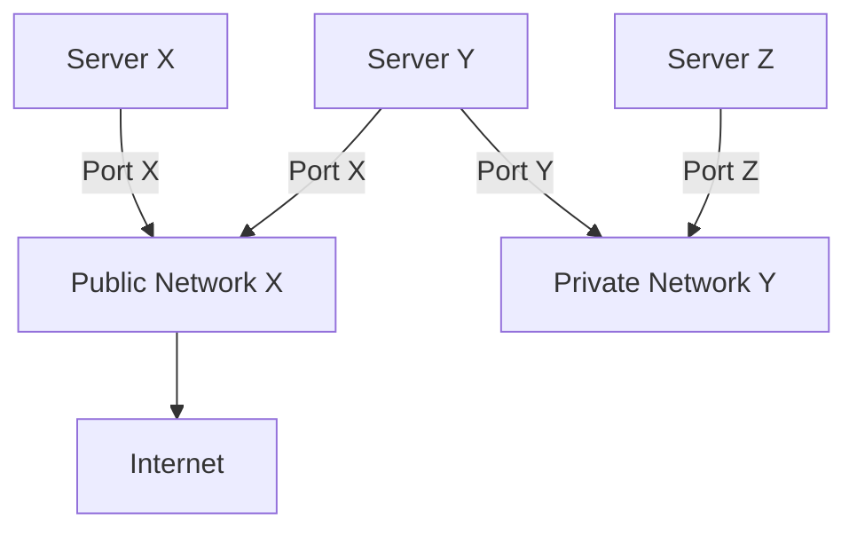

The Open Policy Agent (OPA, pronounced "oh-pa") is an open source,
general-purpose policy engine that unifies policy enforcement across the stack.
OPA provides a high-level declarative language that lets you specify policy as
code and simple APIs to offload policy decision-making from your software. You
can use OPA to enforce policies in microservices, Kubernetes, CI/CD pipelines,
API gateways, and more.

OPA was originally created by [Styra](https://www.styra.com) and is proud to be
a graduated project in the [Cloud Native Computing Foundation
(CNCF)](https://www.cncf.io/) landscape. For details read the CNCF
[announcement](https://www.cncf.io/announcements/2021/02/04/cloud-native-computing-foundation-announces-open-policy-agent-graduation/).

Read this page to learn about the core concepts in OPA's policy language
([Rego](./docs/policy-language)) as well as how to download, run, and integrate OPA.

## What is OPA?

OPA [decouples](./docs/philosophy#policy-decoupling) policy decision-making from policy
enforcement. When your software needs to make policy decisions it **queries**
OPA and supplies structured data (e.g., JSON) as input. OPA accepts arbitrary
structured data as input.

import OverviewDiagram from './assets/OverviewDiagram';

<OverviewDiagram />

OPA generates policy decisions by evaluating the query input against
policies and data. OPA and Rego are domain-agnostic so you can describe almost
any kind of invariant in your policies. For example:

- Which users can access which resources.
- Which subnets egress traffic is allowed to.
- Which clusters a workload must be deployed to.
- Which registries binaries can be downloaded from.
- Which OS capabilities a container can execute with.
- Which times of day the system can be accessed at.

Policy decisions are not limited to simple yes/no or allow/deny answers. Like
query inputs, your policies can generate arbitrary structured data as output.

Let's look at an example. Imagine you work for an organization with the following network infrastructure:



There are three kinds of components in the system:

- Servers expose zero or more protocols (e.g., `http`, `ssh`, etc.)
- Networks connect servers and can be public or private. Public networks are connected to the Internet.
- Ports attach servers to networks.

All the servers, networks, and ports are provisioned using infrastructure as
code. The infrastructure configuration is specified in this JSON representation:

```json
{
  "servers": [
    { "id": "app", "protocols": ["https", "ssh"], "ports": ["p1", "p2", "p3"] },
    { "id": "db", "protocols": ["mysql"], "ports": ["p3"] },
    { "id": "cache", "protocols": ["memcache"], "ports": ["p3"] },
    { "id": "ci", "protocols": ["http"], "ports": ["p1", "p2"] },
    { "id": "busybox", "protocols": ["telnet"], "ports": ["p1"] }
  ],
  "networks": [
    { "id": "net1", "public": false },
    { "id": "net2", "public": false },
    { "id": "net3", "public": true },
    { "id": "net4", "public": true }
  ],
  "ports": [
    { "id": "p1", "network": "net1" },
    { "id": "p2", "network": "net3" },
    { "id": "p3", "network": "net2" }
  ]
}
```

<RunSnippet id="input.json" />

Your organization has established the following security policy that must be implemented:

> 1. Servers reachable from the Internet must not expose the insecure 'http' protocol.
> 2. Servers are not allowed to expose the 'telnet' protocol.

The policy needs to be enforced when servers, networks, and ports are
provisioned and the compliance team wants to periodically audit the system to
find servers that violate the policy.

Let's explore how OPA can help implement this policy.

## Writing Policy with Rego

OPA policies are expressed in a high-level declarative language called Rego.
Rego (pronounced "ray-go") is purpose-built for expressing policies over complex
hierarchical data structures. For detailed information on Rego see the
[Policy Language](./docs/policy-language) documentation.

:::tip
The examples below are interactive! If you edit the input data above
containing servers, networks, and ports, the output will change below.
Similarly, if you edit the queries or rules in the examples below the output
will change. As you read through this section, try changing the input, queries,
and rules and observe the difference in output.

They can also be run locally on your machine using the
[`opa eval` command, here are setup instructions.](#running-opa)

Note that the examples in this section try to represent the best practices.
As such, they make use of keywords that are meant to become standard keywords
at some point in time, but have been introduced gradually.
[See the docs on _future keywords_](./docs/policy-language/#future-keywords)
for more information.
:::

:::note
This section covers the building blocks of writing policies in Rego. You can see
how these concepts come together to solve our network security policy in the
[Complete Example](#complete-example).
:::

### Basic Syntax

To implement our security policy, we first need to access and examine the
infrastructure data. When OPA evaluates policies, it binds data provided in the
query to a global variable called `input`. You can refer to specific parts of
the input data using the `.` (dot) operator.

```rego
package servers

output := input.servers
```

<RunSnippet files="#input.json" command="data.servers.output"/>

To refer to array elements you can use the familiar square-bracket syntax:

```rego
package servers

output := input.servers[0].protocols[0]
```

<RunSnippet files="#input.json" command="data.servers.output"/>

:::tip
You can use the same square bracket syntax if keys contain other than
`[a-zA-Z0-9_]`. E.g., `input["foo~bar"]`.
:::

If you refer to a value that does not exist, OPA returns _undefined_. Undefined
means that OPA was not able to find any results.

```rego
package servers

output := input.foobar
```

<RunSnippet files="#input.json" command="data.servers.output"/>

The most simple policy decisions are made by writing expressions that perform
logical operations on the input data. For example, we can check if a server has
a specific ID using an equality check with `==`.

```rego
package servers

output := input.servers[0].id == "app"
```

<RunSnippet files="#input.json" command="data.servers.output"/>

OPA includes a set of [built-in functions](./docs/policy-reference/builtins) you
can use to perform common operations like string manipulation, regular
expression matching, arithmetic, aggregation, and more.

```rego
package servers

output := count(input.servers[0].protocols) >= 1
```

<RunSnippet files="#input.json" command="data.servers.output"/>

For queries to produce results, all of the expressions in the query must be true
or defined. You can separate expressions across multiple lines (or optionally
join them with `;` - meaning AND, on a single line):

```rego
package servers

output if {
    input.servers[0].id == "app"
    input.servers[0].protocols[0] == "https"
}
```

<RunSnippet files="#input.json" command="data.servers.output"/>

If any of the expressions in the query are not true (or defined) the result is
undefined. In the example below, the second expression is false:

```rego
package servers

output if {
    input.servers[0].id == "app"
    // highlight-next-line
    input.servers[0].protocols[0] == "telnet"
}
```

<RunSnippet files="#input.json" command="data.servers.output"/>

:::note
Expressions are joined together with AND only when they are in the same rule
body. In this example, the checks against `input.servers` are OR'd since they
are in different rule bodies. See [Logical OR](#logical-or) in the Rules section
below for more detail.

```rego
output if {
    input.servers[0].id == "app"
}

output if {
    input.servers[0].protocols[0] == "telnet"
}
```

:::

You can store values in intermediate variables using the `:=` (assignment)
operator to help make more complex rules easier to read. Variables can be
referenced just like `input` and are, like `input`, immutable.

```rego
package servers

output if {
    s := input.servers[0]
    s.id == "app"
    p := s.protocols[0]
    p == "https"
}
```

<RunSnippet files="#input.json" command="data.servers.output"/>

When OPA evaluates expressions, it finds values for the variables that make all
of the expressions true. If there are no variable assignments that make all of
the expressions true, the result is undefined.

```rego
package servers

output if {
    s := input.servers[0]
    s.id == "app"
    s.protocols[1] == "telnet"
}
```

<RunSnippet files="#input.json" command="data.servers.output"/>

Like other declarative languages (e.g., SQL), iteration in Rego happens
implicitly when you inject variables into expressions.

There are explicit iteration constructs to express _FOR ALL_ and _FOR SOME_, [see below](#for-some-and-for-all).

To understand how iteration works in Rego, imagine you need to check if any
networks are public. Recall that the networks are supplied inside an array:
`[{"id": "net1", "public": false}, {"id": "net2", "public": false}, ...]`

One option would be to test each network in the input (which is undefined since
networks 1 and 2 are not public). Incremental definitions of a rule are
[OR'd together](#logical-or) so if any are true, the result of the whole rule is
true.

```rego
package servers

exists_public_network if input.networks[0].public == true
# or
exists_public_network if input.networks[1].public == true
# or
exists_public_network if input.networks[2].public == true
# or
exists_public_network if input.networks[3].public == true
# ...
```

<RunSnippet files="#input.json" command="data.servers.exists_public_network"/>

**This approach is problematic**. There may be too many networks to list
statically, or more importantly, the number of networks may not be known in
advance. In Rego, the solution is to substitute the array index with a variable.

```rego
package servers

exists_public_network if {
    some i
    input.networks[i].public == true
}
```

<RunSnippet files="#input.json" command="data.servers.exists_public_network"/>

Now the query asks for values of `i` that make the overall expression true. When
you substitute variables in references, OPA automatically finds variable
assignments that satisfy all of the expressions in the query. Just like
intermediate variables, OPA returns the values of the variables.

You can substitute as many variables as you want. For example, to find out if
any servers expose the insecure `"http"` protocol you could write:

```rego
package servers

http_server if {
    some i, j
    input.servers[i].protocols[j] == "http"
}
```

<RunSnippet files="#input.json" command="data.servers.http_server"/>

If variables appear multiple times the assignments satisfy all of the
expressions. For example, to find the ids of ports connected to public networks,
you could write:

```rego
package servers

exposed_ports contains port_id if {
    some i, j
    port_id := input.ports[i].id
    input.ports[i].network == input.networks[j].id
    input.networks[j].public
}
```

<RunSnippet files="#input.json" command="data.servers.exposed_ports"/>

Just like references that refer to non-existent fields or expressions that fail
to match, if OPA is unable to find any variable assignments that satisfy all of
the expressions, the result is undefined.

```rego
package servers

ssh_server if {
    some i
    # there is no assignment of i that satisfies the expression
    input.servers[i].protocols[i] == "ssh"
}
```

<RunSnippet files="#input.json" command="data.servers.ssh_server"/>

#### FOR SOME and FOR ALL

While plain iteration serves as a powerful building block, Rego also features ways
to express _FOR SOME_ and _FOR ALL_ more explicitly.

##### FOR SOME (`some`)

`some ... in ...` is used to iterate over the collection (its last argument),
and will bind its variables (key, value position) to the collection items.
It introduces new bindings to the evaluation of the rest of the rule body.

Using `some`, we can express the rules introduced above in different ways:

```rego
package servers

public_network contains net.id if {
    some net in input.networks # some network exists and..
    net.public                 # it is public.
}

shell_accessible contains server.id if {
    some server in input.servers
    "telnet" in server.protocols
}

shell_accessible contains server.id if {
    some server in input.servers
    "ssh" in server.protocols
}
```

<RunSnippet files="#input.json" command="data.servers.shell_accessible"/>

For details on `some ... in ...`, see
[the documentation of the `in` operator](./docs/policy-language/#membership-and-iteration-in).

##### FOR ALL (`every`)

Expanding on the examples above, `every` allows us to succinctly express that
a condition holds for all elements of a domain.

```json title="Edit the input to add a 'telnet' protocol to a server"
{
  "servers": [
    {
      "id": "busybox",
      "protocols": ["http", "ftp"]
    },
    {
      "id": "db",
      "protocols": ["mysql", "ssh"]
    },
    {
      "id": "web",
      "protocols": ["https"]
    }
  ]
}
```

<RunSnippet id="input2.json" />

```rego
package servers

no_telnet_exposed if {
    every server in input.servers {
        not "telnet" in server.protocols
    }
}
```

<RunSnippet files="#input2.json" command="data.servers.no_telnet_exposed"/>

Learn more about the [Every Keyword](./docs/policy-language/#every-keyword).

### Policy Rules

Rego lets you encapsulate and re-use logic with rules. Rules are just if-then
logic statements. Rules can either be "complete" or "partial".

#### Complete Rules

Complete rules are if-then statements that assign a single value to a variable.
Every rule consists of a _head_ and a _body_. In Rego we say the rule head
is true _if_ the rule body is true for some set of variable assignments.

```rego
package rules

# head
exists_public_network := true if {
    # body
    some net in input.networks # some network exists and..
    net.public                 # it is public.
}
```

<RunSnippet files="#input.json" command="data.rules.exists_public_network"/>

You can query for the value generated by rules just like any other value (such as `input` or your own variables):

```rego
package rules

exists_public_network := true if {
    some net in input.networks # some network exists and..
    net.public                 # it is public.
}

another_rule := {
    "public_networks": exists_public_network,
}
```

<RunSnippet id="public_networks.rego" files="#input.json" command="data.rules.another_rule"/>

All values generated by rules can be queried via the global `data` variable from
other packages loaded into OPA.

```rego
package another_package

yet_another_rule := {
    "public_networks": data.rules.exists_public_network,
}
```

<RunSnippet files="#input.json #public_networks.rego" command="data.another_package.yet_another_rule"/>

:::tip
You can query the value of any rule loaded into OPA by referring to it with an
absolute path. The path of a rule is always:
`data.<package-path>.<rule-name>`.
:::

If you omit the `= <value>` part of the rule head the value defaults to `true`.
You could rewrite the example above as follows without changing the meaning:

```rego
exists_public_network if {
    some net in input.networks
    net.public
}
```

To define constants, omit the rule body. When you omit the rule body it defaults
to `true`. Since the rule body is true, the rule head is always true/defined.

```rego
package servers

max_allowed_protocols := 5
```

<RunSnippet command="data.servers.max_allowed_protocols"/>

Constants defined like this can be queried just like any other values:

```rego
count(input.servers[0].protocols) < max_allowed_protocols
```

If OPA cannot find variable assignments that satisfy the rule body, we say that
the rule is undefined. For example, if the `input` provided to OPA does not
include a public network then `exists_public_network` will be undefined (which is
not the same as false.) Below, OPA is given a different set of input networks
(none of which are public):

```json
{
  "networks": [
    { "id": "n1", "public": false },
    { "id": "n2", "public": false }
  ]
}
```

<RunSnippet id="input3.json" />

```rego
package rules

exists_public_network if {
    some net in input.networks
    net.public
}
```

<RunSnippet files="#input3.json" command="data.rules.exists_public_network"/>

#### Partial Rules

Partial rules are if-then statements that generate a set of values and
assign that set to a variable. In the example below `public_network contains net.id` is the rule head and
`some net in input.networks; net.public` is the rule body. You can query for the entire
set of values just like any other value.

```rego
package example

# head
public_network contains net.id if {
    # body
    some net in input.networks # some network exists and..
    net.public                 # it is public.
}
```

<RunSnippet id="public_network_set.rego" files="#input.json" command="data.example"/>

Using the `in` keyword we can use this list to test if some other value is in
the set defined by `public_network`:

```rego
package example

allow if "net3" in public_network
```

<RunSnippet files="#input.json #public_network_set.rego" command="data.example.allow"/>

You can also iterate over the set of values by referencing the set elements with a
variable:

```rego
package example

allow if {
    some net in public_network
    net == "net3"
}
```

<RunSnippet files="#input.json #public_network_set.rego" command="data.example.allow"/>

In addition to partially defining sets, You can also partially define key/value
pairs (aka objects). See
[Rules](https://www.openpolicyagent.org/docs/latest/policy-language/#rules) in
the language guide for more information.

#### Logical OR

When you join multiple expressions together in a query you are expressing
logical AND. To express logical OR in Rego you define multiple rules with the
same name. Let's look at an example.

Imagine you wanted to know if any servers expose protocols that give clients
shell access. To determine this you could define a complete rule that declares
`shell_accessible` to be `true` if any servers expose the `"telnet"` or `"ssh"`
protocols:

```json title="Input with telnet and ssh"
{
  "servers": [
    {
      "id": "busybox",
      "protocols": ["http", "telnet"]
    },
    {
      "id": "db",
      "protocols": ["mysql", "ssh"]
    },
    {
      "id": "web",
      "protocols": ["https"]
    }
  ]
}
```

<RunSnippet id="input4.json" />

```rego
package example.logical_or

default shell_accessible := false

shell_accessible if {
	input.servers[_].protocols[_] == "telnet"
}

shell_accessible if {
	input.servers[_].protocols[_] == "ssh"
}
```

<RunSnippet files="#input4.json" command="data.example.logical_or"/>

:::tip
The `default` keyword tells OPA to assign a value to the variable if all of
the other rules with the same name are undefined.
:::

When you use logical OR with partial rules, each rule definition contributes
to the set of values assigned to the variable. For example, the example above
could be modified to generate a set of servers that expose `"telnet"` or
`"ssh"`.

```rego
package example.logical_or

shell_accessible contains server.id if {
	server := input.servers[_]
	server.protocols[_] == "telnet"
}

shell_accessible contains server.id if {
	server := input.servers[_]
	server.protocols[_] == "ssh"
}
```

<RunSnippet files="#input4.json" command="data.example.logical_or"/>

:::tip
Check out this
[blog post](https://www.styra.com/blog/how-to-express-or-in-rego/)
that goes into much more detail on this topic showing different methods to
express OR in idiomatic Rego for different use cases.
:::

<!---TBD: explain conflicts --->

### Complete Example

The sections above explain the core concepts in Rego. To put it all together
let's review the desired policy in natural language:

> 1. Servers reachable from the Internet must not expose the insecure 'http' protocol.
> 2. Servers are not allowed to expose the 'telnet' protocol.

At a high-level the policy needs to identify servers that violate some
conditions. To implement this policy we could define rules called `violation`
that generate a set of servers that are in violation. For example:

```rego
package example

violation contains message if {   # a server is in the violation set if...
    some server in public_servers # it exists in the 'public_servers' set and...
    "http" in server.protocols    # it contains the insecure "http" protocol.
    message := sprintf("server %s exposes http", [server.id])
}

violation contains message if {  # a server is in the violation set if...
    some server in input.servers # it exists in the input.servers collection and...
    "telnet" in server.protocols # it contains the "telnet" protocol.
    message := sprintf("server %s exposes telnet", [server.id])
}

public_servers contains server if { # a server exists in the public_servers set if...
    some server in input.servers    # it exists in the input.servers collection and...

    some port in server.ports       # it references a port in the input.ports collection and...
    some input_port in input.ports
    port == input_port.id

    # the port references a network in the input.networks collection and...
    some input_network in input.networks
    input_port.network == input_network.id

    # the network is public.
    input_network.public
}
```

<RunSnippet files="#input.json" command="data.example.violation"/>

This example demonstrates how we can use Rego to create a clear list of policy
violations that can be handed back to the infrastructure as code system to
present to the user, making it easy for them to see what's gone wrong.

## Running OPA

This section explains how you can query OPA directly and interact with it on
your own machine. If you just want to quickly get a feel for the language
without installing anything, check out the
[OPA Playground](https://play.openpolicyagent.org/).

### 1. Download OPA

<Tabs queryString="current-os">
<TabItem value="macos" label="macOS" default>
  OPA binaries can be installed on macOS using Homebrew. The formula can be
  reviewed on [brew.sh](https://formulae.brew.sh/formula/opa). This method
  supports both ARM64 and AMD64 architectures.
  ```shell
  brew install opa
  ```

It's also possible to download the OPA binary directly:

<Tabs>
  <TabItem value="arm64" label="arm64 (Apple Silicon)" default>
    ```shell
    curl -L -o opa https://openpolicyagent.org/downloads/latest/opa_darwin_arm64_static
    ```
  </TabItem>
  <TabItem value="amd64" label="amd64 (Older Intel Macs)">
    ```shell
    curl -L -o opa https://openpolicyagent.org/downloads/latest/opa_darwin_amd64
    ```
  </TabItem>
</Tabs>

After downloading the OPA binary, you must ensure it's executable:

```shell
chmod 755 ./opa
```

It's also recommended to move the OPA binary into a directory in your
`PATH` so you can run OPA commands in different directories.

You can verify the installation by running:

```shell
opa version
```

</TabItem>

<TabItem value="linux" label="Linux/Unix">
There are a number of packages repos that provide OPA binaries for Linux/Unix.
For example:

- [Arch](https://archlinux.org/packages/extra/x86_64/open-policy-agent/)
- [nixpkgs](https://github.com/NixOS/nixpkgs/blob/master/pkgs/by-name/op/open-policy-agent/package.nix)
- [Wolfi](https://github.com/wolfi-dev/os/blob/main/opa.yaml)
- [FreeBSD](https://cgit.freebsd.org/ports/tree/sysutils/opa)
- [NetBSD](https://pkgsrc.se/devel/opa)

In order to manually install the OPA binary from the GitHub release assets,
please run the following:

<Tabs>
  <TabItem value="linux_arm64" label="arm64" default>
    ```shell
    curl -L -o opa https://openpolicyagent.org/downloads/latest/opa_linux_arm64_static
    ```
  </TabItem>
  <TabItem value="linux_amd64" label="amd64">
    ```shell
    curl -L -o opa https://openpolicyagent.org/downloads/latest/opa_linux_amd64
    ```
  </TabItem>
</Tabs>
After downloading the OPA binary, you must ensure it's executable:
```shell
chmod 755 ./opa
```
It's also recommended to move the OPA binary into a directory in your
`PATH` so you can run OPA commands in any directory.

You can verify the installation by running:

```shell
opa version
```

</TabItem>

<TabItem value="windows" label="Windows">
Download the Windows binary using PowerShell:

```powershell
Invoke-WebRequest -Uri "https://openpolicyagent.org/downloads/latest/opa_windows_amd64.exe" -OutFile "opa.exe"
```

Or using curl (if available):

```cmd
curl -L -o opa.exe https://openpolicyagent.org/downloads/latest/opa_windows_amd64.exe
```

Add the OPA binary to your PATH by creating a Tools directory for it:

```cmd
mkdir C:\Tools\OPA
move opa.exe C:\Tools\OPA\
```

Now we can add this to our `PATH`:

Control Panel → System → Advanced system settings → Environment Variables

Edit the Path variable → Add: `C:\Tools\OPA`

Alternatively, run:

```powershell
[Environment]::SetEnvironmentVariable("Path", "$env:Path;C:\Tools\OPA", "User")
```

You can verify the installation by running:

```cmd
opa version
```

</TabItem>
<TabItem value="docker" label="Docker">
You can also download and run OPA via Docker. The latest stable image tag is
`openpolicyagent/opa:latest`.

You can verify the installation by running:

```shell
docker run --rm -it openpolicyagent/opa:latest version
```

</TabItem>
</Tabs>

See all available binaries on the
[GitHub releases](https://github.com/open-policy-agent/opa/releases).
Checksums for all binaries are available in the download path by appending
`.sha256` to the binary filename.

For example, verify the macOS arm64 binary checksum:

```shell
BINARY_NAME=opa_darwin_arm64_static
curl -L -o opa_darwin_amd64 https://openpolicyagent.org/downloads/latest/$BINARY_NAME
curl -L -o opa_darwin_amd64.sha256 https://openpolicyagent.org/downloads/latest/$BINARY_NAME.sha256
shasum -c $BINARY_NAME.sha256
```

### 2. Try `opa eval`

The simplest way to interact with OPA is via the command-line using the [`opa eval` sub-command](./docs/cli/#opa-eval).
It is a swiss-army knife that you can use to evaluate arbitrary Rego expressions and policies.
`opa eval` supports a large number of options for controlling evaluation.
Commonly used flags include:

| Flag             | Short | Description                                                                                                                                     |
| ---------------- | ----- | ----------------------------------------------------------------------------------------------------------------------------------------------- |
| `--bundle`       | `-b`  | Load a [bundle file](./docs/management-bundles/#bundle-file-format) or directory into OPA. This flag can be repeated.                           |
| `--data`         | `-d`  | Load policy or data files into OPA. This flag can be repeated.                                                                                  |
| `--input`        | `-i`  | Load a data file and use it as `input`. This flag cannot be repeated.                                                                           |
| `--format`       | `-f`  | Set the output format to use. The default is `json` and is intended for programmatic use. The `pretty` format emits more human-readable output. |
| `--fail`         | n/a   | Exit with a non-zero exit code if the query is undefined.                                                                                       |
| `--fail-defined` | n/a   | Exit with a non-zero exit code if the query is not undefined.                                                                                   |

For example:

```json title="input.json"
{
  "servers": [
    { "id": "app", "protocols": ["https", "ssh"], "ports": ["p1", "p2", "p3"] },
    { "id": "db", "protocols": ["mysql"], "ports": ["p3"] },
    { "id": "cache", "protocols": ["memcache"], "ports": ["p3"] },
    { "id": "ci", "protocols": ["http"], "ports": ["p1", "p2"] },
    { "id": "busybox", "protocols": ["telnet"], "ports": ["p1"] }
  ],
  "networks": [
    { "id": "net1", "public": false },
    { "id": "net2", "public": false },
    { "id": "net3", "public": true },
    { "id": "net4", "public": true }
  ],
  "ports": [
    { "id": "p1", "network": "net1" },
    { "id": "p2", "network": "net3" },
    { "id": "p3", "network": "net2" }
  ]
}
```

```rego title="example.rego"
package example

default allow := false                              # unless otherwise defined, allow is false

allow if {                                          # allow is true if...
    count(violation) == 0                           # there are zero violations.
}

violation contains server.id if {                   # a server is in the violation set if...
    some server
    public_servers[server]                           # it exists in the 'public_servers' set and...
    server.protocols[_] == "http"                   # it contains the insecure "http" protocol.
}

violation contains server.id if {                   # a server is in the violation set if...
    server := input.servers[_]                      # it exists in the input.servers collection and...
    server.protocols[_] == "telnet"                 # it contains the "telnet" protocol.
}

public_servers contains server if {                  # a server exists in the 'public_servers' set if...
    some i, j
    server := input.servers[_]                      # it exists in the input.servers collection and...
    server.ports[_] == input.ports[i].id            # it references a port in the input.ports collection and...
    input.ports[i].network == input.networks[j].id  # the port references a network in the input.networks collection and...
    input.networks[j].public                        # the network is public.
}
```

```bash
# Evaluate a trivial expression.
./opa eval "1*2+3"

# Evaluate a policy on the command line.
./opa eval -i input.json -d example.rego "data.example.violation[x]"

# Evaluate a policy on the command line and use the exit code.
./opa eval --fail-defined -i input.json -d example.rego "data.example.violation[x]"
echo $?
```

### 3. Try `opa run` (interactive)

OPA includes an interactive shell or REPL (Read-Eval-Print-Loop) accessible via
the [`opa run` sub-command](./docs/cli/#opa-run).
You can use the REPL to experiment with policies and prototype new ones.

To start the REPL just:

```bash
./opa run
```

When you enter statements in the REPL, OPA evaluates them and prints the result.

```rego
> true
true
> 3.14
3.14
> ["hello", "world"]
[
  "hello",
  "world"
]
```

Most REPLs let you define variables that you can reference later on. OPA allows
you to do something similar. For example, you can define a `pi` constant as
follows:

```rego
> pi := 3.14
```

Once `pi` is defined, you query for the value and write expressions in terms of
it:

```rego
> pi
3.14
> pi > 3
true
```

Quit out of the REPL by pressing Control-D or typing `exit`:

```rego
> exit
```

You can load policy and data files into the REPL by passing them on the command
line. By default, JSON and YAML files are rooted under `data`.

```shell
opa run input.json
```

Run a few queries to poke around the data:

```rego
> data.servers[0].protocols[1]
```

```rego
> data.servers[i].protocols[j]
```

```rego
> net := data.networks[_]; net.public
```

To set a data file as the `input` document in the REPL prefix the file path:

```shell
opa run example.rego repl.input:input.json
```

```rego
> data.example.public_servers[s]
```

:::info
Prefixing file paths with a reference controls where file is loaded under
`data`. By convention, the REPL sets the `input` document that queries see by
reading `data.repl.input` each time a statement is evaluated. See `help input`
for details in the REPL.
:::

Quit out of the REPL by pressing Control-D or typing `exit`:

```rego
> exit
```

### 4. Try `opa run` (server)

To integrate with OPA you can run it as a server and execute queries over HTTP.
You can start OPA as a server with `-s` or `--server`:

```bash
./opa run --server ./example.rego
```

By default OPA listens for HTTP connections on `localhost:8181`. See `opa run --help` for a list of options to change the listening address, enable TLS, and
more.

Inside of another terminal use `curl` (or a similar tool) to access OPA's HTTP
API. When you query the `/v1/data` HTTP API you must wrap input data inside of a
JSON object:

```json
{
    "input": <value>
}
```

Create a copy the input file for sending via `curl`:

```
cat <<EOF > v1-data-input.json
{
    "input": $(cat input.json)
}
EOF
```

Execute a few `curl` requests and inspect the output:

```bash
curl localhost:8181/v1/data/example/violation -d @v1-data-input.json -H 'Content-Type: application/json'
curl localhost:8181/v1/data/example/allow -d @v1-data-input.json -H 'Content-Type: application/json'
```

By default `data.system.main` is used to serve policy queries without a path.
When you execute queries without providing a path, you do not have to wrap the
input. If the `data.system.main` decision is undefined it is treated as an
error:

```bash
curl localhost:8181 -i -d @input.json -H 'Content-Type: application/json'
```

You can restart OPA and configure to use any decision as the default decision:

```
./opa run --server --set=default_decision=example/allow ./example.rego
```

Re-run the last `curl` command from above:

```bash
curl localhost:8181 -i -d @input.json -H 'Content-Type: application/json'
```

### 5. Try OPA as a Go library

OPA can be embedded inside Go programs as a library. The simplest way to embed
OPA as a library is to import the `github.com/open-policy-agent/opa/rego`
package.

```go
import "github.com/open-policy-agent/opa/rego"
```

Call the `rego.New` function to create an object that can be prepared or
evaluated:

```go
r := rego.New(
    rego.Query("x = data.example.allow"),
    rego.Load([]string{"./example.rego"}, nil))
```

The `rego.Rego` supports several options that let you customize evaluation. See
the [GoDoc](https://godoc.org/github.com/open-policy-agent/opa/rego) page for
details. After constructing a new `rego.Rego` object you can call
`PrepareForEval()` to obtain an executable query. If `PrepareForEval()` fails it
indicates one of the options passed to the `rego.New()` call was invalid (e.g.,
parse error, compile error, etc.)

```go
ctx := context.Background()
query, err := r.PrepareForEval(ctx)
if err != nil {
    // handle error
}
```

The prepared query object can be cached in-memory, shared across multiple
goroutines, and invoked repeatedly with different inputs. Call `Eval()` to
execute the prepared query.

```go
bs, err := ioutil.ReadFile("./input.json")
if err != nil {
    // handle error
}

var input interface{}

if err := json.Unmarshal(bs, &input); err != nil {
    // handle error
}

rs, err := query.Eval(ctx, rego.EvalInput(input))
if err != nil {
    // handle error
}
```

The policy decision is contained in the results returned by the `Eval()` call.
You can inspect the decision and handle it accordingly:

```go
// In this example we expect a single result (stored in the variable 'x').
fmt.Println("Result:", rs[0].Bindings["x"])
```

You can combine the steps above into a simple command-line program that
evaluates policies and outputs the result:

```go title="main.go"
package main

import (
	"context"
	"encoding/json"
	"fmt"
	"log"
	"os"

	"github.com/open-policy-agent/opa/v1/rego"
)

func main() {
	ctx := context.Background()

	// Construct a Rego object that can be prepared or evaluated.
	r := rego.New(
		rego.Query(os.Args[2]),
		rego.Load([]string{os.Args[1]}, nil))

	// Create a prepared query that can be evaluated.
	query, err := r.PrepareForEval(ctx)
	if err != nil {
		log.Fatal(err)
	}

	// Load the input document from stdin.
	var input interface{}
	dec := json.NewDecoder(os.Stdin)
	dec.UseNumber()
	if err := dec.Decode(&input); err != nil {
		log.Fatal(err)
	}

	// Execute the prepared query.
	rs, err := query.Eval(ctx, rego.EvalInput(input))
	if err != nil {
		log.Fatal(err)
	}

    // Do something with the result.
	fmt.Println(rs)
}
```

Run the code above as follows:

```shell
go run main.go example.rego 'data.example.violation' < input.json
```

## Next Steps

Congratulations on completing the introduction to OPA. You have learned the core
concepts behind OPA's policy language as well as how to get OPA and run it on
your own.

If you have more questions about how to write policies in Rego check out:

- The [Policy Reference](./docs/policy-reference) page for reference documentation on built-in functions.
- The [Policy Language](./docs/policy-language) page for complete descriptions of all language features.

If you want to try OPA for a specific use case check out:

- The [Ecosystem](./ecosystem) page which showcases various of OPA integrations.

Some popular tutorials include:

- The [Kubernetes](./docs/kubernetes) page for how to use OPA as an admission controller in Kubernetes.
- The [Envoy](./docs/envoy) page for how to use OPA as an external authorizer with Envoy.
- The [Terraform](./docs/terraform) page for how to use OPA to validate Terraform plans.

Don't forget to install the OPA (Rego) Plugin for your favorite
[IDE or Text Editor](./docs/editor-and-ide-support).
