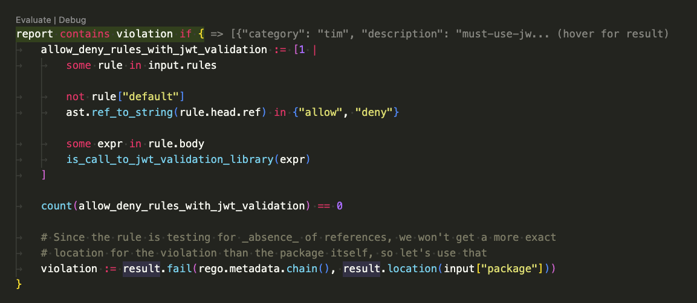
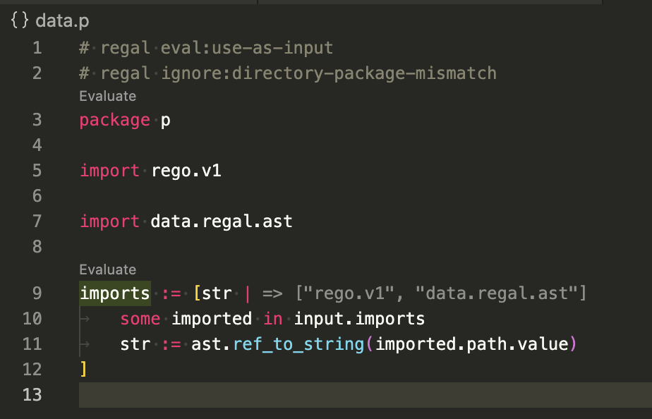

<head>
  <title>Custom Rules | Regal</title>
</head>

# Custom Rules

Regal is built to be easily extended. Using custom rules is a great way to enforce naming conventions, best practices
or more opinionated rules across teams and organizations.

There are two types of custom rules to be aware of — those that are included with Regal in the `custom` category, and
those that you write yourself. The rules in the `custom` category provide a way to enforce common organizational
requirements, like naming conventions, by means of _configuration_ rather than code. If your requirements aren't
fulfilled by the rules in this category, your other option is to write your own custom rules using Rego.

## Your Own Custom Rules

If you'd like to provide your own linter rules for a project, you may do so by placing them in a `rules` directory
inside the `.regal` directory preferably placed in the root of your project (which is also where custom configuration
resides). The directory structure of a policy repository with custom linter rules might then look something like this:

```text
.
├── .regal
│   ├── config.yaml
│   └── rules
│       ├── naming.rego
│       └── naming_test.rego
└── policy
    ├── authz.rego
    └── authz_test.rego
```

If you so prefer, custom rules may also be provided using the `--rules` option for `regal lint`, which may point either
to a Rego file, or a directory containing Rego files and potentially data (JSON or YAML).

## Creating a New Rule

The simplest way to create a new rule is to use the `regal new rule` command. This command provides scaffolding for
quickly creating a new rule, including a file for testing. The command has two required arguments: `--category` and
`--name`, which should be self-explanatory. To create a new custom rule:

```shell
regal new rule --category naming --name foo-bar-baz
```

This will create a `.regal/rules` directory in the current working directory, if one does not already exist, and place
a starter policy and a test in a directory structure based on `--category` and `--name` in it. Following the above
example would create the following directory structure under `.regal/rules`:

```text
custom/regal/rules/naming/foo-bar-baz/foo_bar_baz.rego
custom/regal/rules/naming/foo-bar-baz/foo_bar_baz_test.rego
```

If you'd rather create this directory structure in some other place than the current working directory, you may use the
`--output` flag to specify a different location. The generated rule includes a simple example, which can be verified by
running `regal test .regal/rules`. Modify the rule and the test to suit your needs!

If you'd like to create a new built-in rule for submitting a PR in Regal, you may add the `--type builtin` flag to the
command (the default is `custom`). This will create a similar scaffolding under `bundle/regal/rules` in the Regal
repository.

## Developing Rules

Regal rules works primarily with the [abstract syntax tree](https://en.wikipedia.org/wiki/Abstract_syntax_tree) (AST)
provided by OPA's parser as input. The top level item in the AST is the
[module](https://pkg.go.dev/github.com/open-policy-agent/opa/ast#Module), which contains nodes for everything found
in a policy, like the package declaration, imports and rules.

Since OPA expects JSON as input, the module and all its child nodes are serialized, and then made available as `input`
in Regal linter rule policies. The `opa parse --format json` command can be used to get an idea of what the structure
of the serialized AST looks like. However, recent versions of Regal leverage an optimized AST JSON representation called
[roast](https://www.openpolicyagent.org/projects/regal/custom-rules/roast), which is both more compact and performant to
traverse as part of linting. See the roast docs for more information on how the format differs from the "normal" OPA
AST.

In order to view the JSON AST representation of a policy, use the `regal parse` command. This works similarly to
`opa parse`, but only outputs the roast JSON format, including additions made by Regal.

If we were to write the simplest policy possible, and parse it using `regal parse`, it would contain nothing but a
package declaration:

```rego title="policy.rego"
package policy
```

Using `regal parse policy.rego`, we're provided with the AST of the above policy:

```json
{
  "package": {
    "location": "1:1:1:8",
    "path": [
      {
        "type": "var",
        "value": "data"
      },
      {
        "location": "1:9:1:15",
        "type": "string",
        "value": "policy"
      }
    ]
  },
  "regal": {
    "file": {
      "name": "policy.rego",
      "lines": [
        "package policy",
        ""
      ],
      "abs": "/Users/anderseknert/tmp/custom/policy.rego"
    },
    "environment": {
      "path_separator": "/"
    }
  }
}
```

As trivial as may be, it's enough to build our first linter rule! Let's say we'd like to enforce a uniform naming
convention on any policy in a repository. Packages may be named anything, but must start with the name of the
organization (Acme Corp). So `package acme.corp.policy` should be allowed, but not `package policy` or
`package policy.acme.corp`. One exception: policy authors should be allowed to write policy for the `system.log` package
provided by OPA to allow
[masking](https://www.openpolicyagent.org/docs/management-decision-logs/#masking-sensitive-data) sensitive data
from decision logs.

An example policy to implement this requirement might look something like this:

```rego
# METADATA
# description: All packages must use "acme.corp" base name
# related_resources:
# - description: documentation
#   ref: https://www.acmecorp.example.org/docs/regal/package
# schemas:
# - input: schema.regal.ast
package custom.regal.rules.naming["acme-corp-package"]

import data.regal.result

report contains violation if {
    not acme_corp_package
    not system_log_package

    violation := result.fail(rego.metadata.chain(), result.location(input.package.path[1]))
}

acme_corp_package if {
    input.package.path[1].value == "acme"
    input.package.path[2].value == "corp"
}

system_log_package if {
    input.package.path[1].value == "system"
    input.package.path[2].value == "log"
}
```

Starting from top to bottom, these are the components comprising our custom rule:

1. The package of custom rules **must** start with `custom.regal.rules`, followed by the category of the rule, and the
   title (which is commonly quoted as rule names use `-` for spaces).
1. The `data.regal.result` provides some helpers for formatting the result of a violation for inclusion in a report.
1. Regal rules make heavy use of [metadata annotations](https://www.openpolicyagent.org/docs/policy-language/#annotations)
   in order to document the purpose of the rule, along with any other
   information that could potentially be useful. All rule packages **must** have
   a `description`. Providing links to additional documentation under
   `related_resources` is recommended, but not required.
1. Note the `schema` attribute present in the metadata annotation. Adding this is optional, but highly recommended, as
   it will make the compiler aware of the structure of the input, i.e. the AST. This allows the compiler to fail when
   unknown attributes are referenced, due to typos or other mistakes. The compiler will also fail when an attribute is
   referenced using a type it does not have, like referring to a string as if it was a number. Set to `schema.regal.ast`
   to use the AST schema provided by Regal.
1. Regal will evaluate any rule named `report` in each linter policy, so at least one `report` rule **must** be present.
1. In our example `report` rule, we evaluate another rule (`acme_corp_package`) in order to know if the package name
   starts with `acme.corp`, and another rule (`system_log_package`) to know if it starts with `system.log`. If neither
   of the conditions are true, the rule fails and violation is created.
1. The violation is created by calling `result.fail`, which takes the metadata from the package (using
   `rego.metadata.chain` which conveniently also includes the path of the package) and returns a result, which
   will later be included in the final report provided by Regal.
1. The `result.location` helps extract the location from the element failing the test. Make sure to use it!

### Rule Development Workflow

In addition to making use of the `regal parse` command to inspect the AST of a policy, using Regal's
[language server](https://www.openpolicyagent.org/projects/regal/language-server) for rule development provides the absolute best rule
development experience.

#### Code Lens for Evaluation

If you're using VS Code and the [OPA VS Code extension](https://github.com/open-policy-agent/vscode-opa), you may
use the [Code Lens for Evaluation](https://www.openpolicyagent.org/projects/regal/language-server#code-lenses-evaluation) to directly
evaluate packages and rules using the `input.json` file as input, and see the result directly in your editor on the
line you clicked to evaluate.

To start evaluating a policy against your custom rule. First turn the parse result of the policy into an input file:

```shell
regal parse path/to/policy.rego > input.json
```

You should now be able evaluate your custom rule against the `input.json` AST:



**Tips:**

- You can hover the inlined result to see the full output
- Calls to `print` inside rule bodies will have the print output displayed on the same line

As another convenience, any `.rego` file where the first comment in the policy is `# regal eval:use-as-input` will have
the evaluation feature automatically use the AST of the file as input. This allows building queries against the AST of
the policy you're working on, providing an extremely fast feedback loop for developing new rules!



#### Test-Driven Development

Using a test-driven approach to custom rule development is a great way to both understand how your rule works, and to
assert that it works as expected even as you make changes to the code. Use the `regal test` command the same way as you
would use `opa test`:

```shell
regal test .regal/rules
```

To debug failures in your test, the `--var-values` flag can help by providing more information about which values
failed to match the expected output. You can also use the `print` function anywhere in your policy, which will have
it's output printed by the test runner.

Tests commonly first parse a policy, then provide that as input to the rule being tested. You can either use the
built-in `regal.parse_module(name, policy)` function to parse a policy, or one of the provided helpers in the
`regal.ast` package:

Using `ast.with_rego_v1(policy)` will have a package declararation and `import rego.v1` added to the policy, allowing
you to get straight to what you actually want to test for:

```rego
test_fail_constant_condition if {
    module := ast.with_rego_v1(`allow if true`)
    report := rule.report with input as module

    count(report) == 1
    some violation in report
    violation.title == "constant-conditoon"
}
```

The `ast.policy(policy)` adds only a package declaration and not `import rego.v1`.

## Aggregate Rules

Aggregate rules are a special type of rule that allows you to collect data from multiple files before making a decision.
This is needed in some cases where a single policy file won't be enough for a linter rule to make a decision. For
example, you may want to enforce that in a policy repository, there must be at least one package annotated with an
`authors` attribute. This requires first collecting annotation data from all the provided policies, and then have the
rule use this data to make a decision. The structure of an aggregate rule is similar to a regular rule, but with a few
notable differences. The most significant one is that linting happens in two separate phases — one that aggregates data
from files, and one that actually lints and reports violations using that data.

```rego
# METADATA
# description: |
#   There must be at least one boolean rule named `allow`, and it must
#   have a default value of `false`
# related_resources:
# - description: documentation
#   ref: https://www.acmecorp.example.org/docs/regal/aggregate-allow
# schemas:
# - input: schema.regal.ast
package custom.regal.rules.organizational["at-least-one-allow"]

import data.regal.ast
import data.regal.result

aggregate contains entry if {
    # ast.rules is input.rules with functions filtered out
    some rule in ast.rules

    # search for rule named allow
    ast.ref_to_string(rule.head.ref) == "allow"

    # make sure it's a default assignment
    # ideally we'll want more than that, but the *requirement* is only
    # that such a rule exists...
    rule["default"] == true

    # ...and that it defaults to false
    rule.head.value.type == "boolean"
    rule.head.value.value == false

    # if found, collect the result into our aggregate collection
    # we don't really need the location here, but showing for demonstration
    entry := result.aggregate(rego.metadata.chain(), {
        # optional metadata here
        "package": input.package,
    })
}

# METADATA
# description: |
#   This is called once all aggregates have been collected. Note the use of a
#   different schema here for type checking, as the input is no longer the AST
#   of a Rego policy, but our collected data.
# schemas:
#   - input: schema.regal.aggregate
aggregate_report contains violation if {
    # input.aggregate contains only the entries collected by *this* aggregate rule,
    # so you don't need to worry about counting entries from other sources here!
    count(input.aggregate) == 0

    # no aggregated data found, so we'll report a violation
    # another rule may of course want to make use of the data collected in the aggregation
    violation := result.fail(rego.metadata.chain(), {
        "message": "At least one rule named `allow` must exist, and it must have a default value of `false`",
    })
}
```

As you can see, the aggregate rule is split into two parts — one that collects data (`aggregate`), and one that reports
violations (`aggregate_report`).

Use of helper functions like `result.aggregate` is optional, but **highly** recommended, as it will have any aggregate
entry contain information like file, location and package, which is useful both for reporting, but also for debugging.
Use a `print` or two in the `aggregate_report` rule to see exactly what's included!

## Parsing and Testing

Regal provides a few tools mirrored from OPA in order to help test and debug custom rules. These are necessary since OPA
is not aware of the custom [built-in functions](#built-in-functions) included in Regal, and will fail when encountering
e.g. `regal.parse_module` in a custom linter policy. The following commands are included with Regal to help you author
custom rules:

- `regal parse` works similarly to `opa parse`, but will always output JSON and include location information, and any
  additional data added to the AST by Regal. Use this if you want to know exactly what the `input` will look like for
  any given policy, when provided to Regal for linting.
- `regal test` works like `opa test`, but aware of any custom Regal additions, and the schema used for the AST. Use this
  to test custom linter rules, e.g. `regal test .regal/rules`.

Note that the `print` built-in function is enabled for `regal test`. Good to use for quick debugging!

## Built-in Functions

Regal provides a few custom built-in functions tailor-made for linter policies.

### `regal.parse_module(filename, policy)`

Works just like `rego.parse_module`, but provides an AST including location information, and custom additions added
by Regal, like the text representation of each line in the original policy. This is useful for authoring tests to assert
linter rules work as expected. This is the built-in function equivalent of the `regal parse` command.

If the `filename` provided ends with `_v0.rego`, the policy will be parsed as a Rego v0 module.

### `regal.last(array)`

This built-in function is a much more performant way to express `array[count(array) - 1]`. This performance difference
is almost always irrelevant in "normal" Rego policies, but can have a significant impact in linter rules where it's
sometimes called thousands of times as part of traversing the input AST.

## Rego Library

In addition to this, Regal provides many helpful functions, rules and utilities in Rego. Browsing the source code of the
[regal.ast](https://github.com/open-policy-agent/regal/blob/main/bundle/regal/ast/ast.rego) package to see what's
available is recommended!

Note however that at this point in time, the Rego API is not considered stable, and breaking changes are likely to
occur between versions. If you need stable versions of rules and functions found here, consider copying them into a
library of your own, and use in your custom rules. Or engage with the Regal community and tell us what you need and
depend on, and we'll try to take it into account, or at least help you find ways to make it work!

## Language server

When using custom rules with the Regal language server, rules will be loaded
from the `.regal/rules` directory relative to the selected workspace root.

Custom rules will be loaded each time a lint is run for a file or the workspace.
If your custom rules are broken, fixes will be used on the next linting run.
