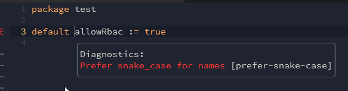

<head>
  <title>Editor Support | Regal</title>
</head>

# Editor Support

## Visual Studio Code

[vscode-opa](https://marketplace.visualstudio.com/items?itemName=tsandall.opa) -
the official OPA extension for Visual Studio Code - now supports the Regal language server.

To see Regal linting as you work, install the extension at version `0.13.3` or later
and open a workspace with Rego files.

The plugin will automatically find and use [Regal config](https://www.openpolicyagent.org/projects/regal#configuration).

### Debug Adapter Protocol (DAP)

From
[`v0.17.0`](https://github.com/open-policy-agent/vscode-opa/blob/main/CHANGELOG.md#0170)
onwards, the OPA extension for Visual Studio Code supports the
[Regal Debug Adapter](https://www.openpolicyagent.org/projects/regal/debug-adapter).

To start a new debug session use the code action `Debug` found above a Rego rule
or package.


Breakpoints can be added by clicking in the gutter to the left of the editor.
Print statements will be shown in the debug console.

## Zed

[Zed](https://zed.dev) is a modern open-source code editor with focus on performance and simplicity.

Zed supports Rego via Regal and the [zed-rego](https://github.com/StyraInc/zed-rego) extension developed by the Styra
community. The extension provides syntax highlighting, linting, and most of the other language server features provided
by Regal.

## Neovim

[Neovim](https://neovim.io/) supports both the Language Server Protocol and the Debug Adapter Protocol.

Generally, the Regal binary should be [installed](https://www.openpolicyagent.org/projects/regal#getting-started)
first. [`mason.vim`](https://github.com/williamboman/mason.nvim) users can install the
Regal binary with `:MasonInstall regal`
([package definition](https://github.com/mason-org/mason-registry/blob/2024-07-23-asian-hate/packages/regal/package.yaml)).

### Language Server Protocol (LSP)

There are a number of different plugins available for Neovim which integrate
with language servers using the Language Server Protocol.

Below are a number of different plugin options to configure a language server
client for Regal in Neovim.

#### nvim-lspconfig

[nvim-lspconfig](https://github.com/neovim/nvim-lspconfig) has native support for the
Regal language server. Use the configuration below to configure Regal:

```lua
require('lspconfig').regal.setup()
```

#### none-ls

[none-ls](https://github.com/nvimtools/none-ls.nvim) - Use Neovim as a
language server to inject LSP diagnostics, code actions, and more via Lua.

Minimal installation via [VimPlug](https://github.com/junegunn/vim-plug)

```vim
Plug 'nvim-lua/plenary.nvim'
Plug 'nvimtools/none-ls.nvim'

lua <<EOF
local null_ls = require("null-ls")
null_ls.setup {
    sources = { null_ls.builtins.diagnostics.regal }
}
EOF
```

Using sample rego file `test.rego` with following content

```rego
package test

default allowRbac := true
```

Example of the diagnostics in as shown in the UI:



#### nvim-cmp

[nvim-cmp](https://github.com/hrsh7th/nvim-cmp) supports the adding of language
servers as a source.

To use Regal with `nvim-cmp`, it is recommended that you use
the [`nvim-lspconfig` source](https://github.com/hrsh7th/cmp-nvim-lsp) and
follow the instructions above to configure `nvim-lspconfig`.

#### Other plugins

To see live linting of Rego, your plugin must support
[`textDocument/diagnostic`](https://microsoft.github.io/language-server-protocol/specifications/lsp/3.17/specification/#textDocument_diagnostic)
messages.

There are many language server integrations for Neovim, if you'd like to see
another one listed, please [open an issue](https://github.com/open-policy-agent/regal/issues/new)
or drop us a message in [Slack](https://slack.openpolicyagent.org).

### Debug Adapter Protocol (DAP)

#### nvim-dap and nvim-dap-rego

[nvim-dap](https://github.com/mfussenegger/nvim-dap) is a DAP client
implementation for Neovim.
This plugin provides basic functions to control debuggers from Neovim.

[nvim-dap-rego](https://github.com/rinx/nvim-dap-rego) provides basic
configurations for Regal's DAP interface.

To set up Regal's debugger,

```lua
require('dap-rego').setup()
```

Then you can launch debug sessions by calling `:lua require('dap').continue()`.

## Helix

The [Helix](https://helix-editor.com/) editor comes with a default config that tries to
use `regols` for Rego files.
You can make it use Regal instead via this `languages.toml` config:

```toml
[[language]]
name = "rego"
scope = "source.rego"
roots = [".regal/config.yaml"]
file-types = ["rego"]
indent = { tab-width = 4, unit = "\t" }
comment-token = "#"
language-servers = [ { name = "regal" } ]

[language-server.regal]
command = "regal"
args = ["language-server"]
config = { provideFormatter = true }
```

[See the languages docs](https://docs.helix-editor.com/languages.html#language-configuration)
for details.

## Kakoune

The [Kakoune](https://kakoune.org) editor has a plugin for LSP support,
[kakoune-lsp](https://github.com/kakoune-lsp/kakoune-lsp). You can use Regal
with this plugin using this config:

```kak
hook global BufCreate .+\.rego %{
    set-option buffer filetype rego
}
hook global BufSetOption filetype=rego %{
    set-option buffer lsp_language_id rego
    set-option buffer lsp_servers %{
        [regal]
        root_globs = [".git", ".hg", ".regal"]
        command = "regal"
        args = ["language-server"]

        # these three lines are optional, to configure initializationOptions
        settings_section = "regal"
        [regal.settings.regal]
        formatter = "opa fmt --rego-v1"

    }
}
```
