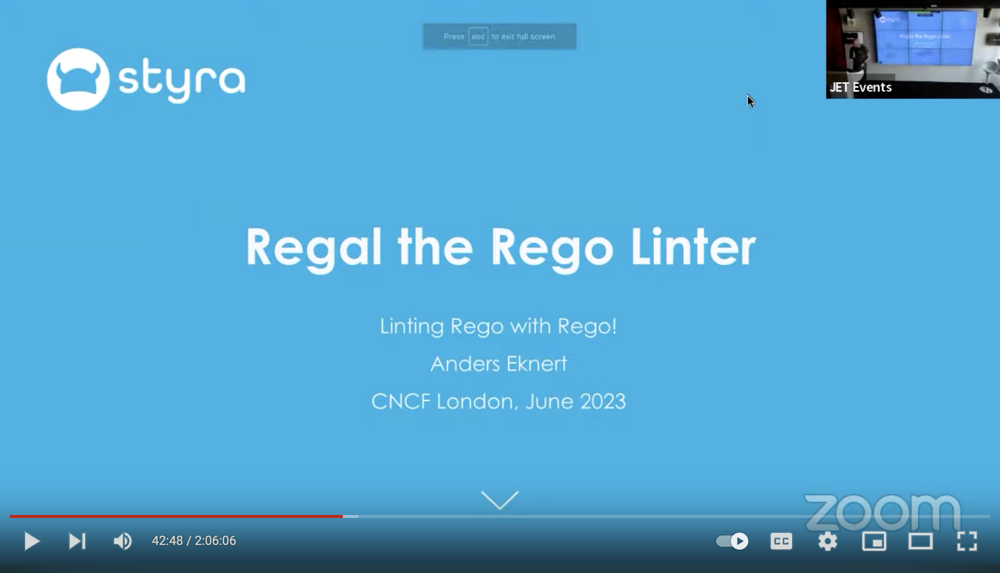

<!-- markdownlint-disable MD033 -->
<head>
<!-- markdownlint-disable MD033 -->
  <title>Introduction | Regal</title>
</head>

<!-- markdownlint-disable MD041 -->

import Intro from '@site/src/components/projects/regal/Intro';

<!-- markdownlint-disable MD025 -->

# Regal

Regal is a linter and language server for
[Rego](https://www.openpolicyagent.org/docs/policy-language), making
your Rego magnificent, and you the ruler of rules!

With its extensive set of linter rules, documentation and editor integrations,
Regal is the perfect companion for policy development, whether you're an
experienced Rego developer or just starting out.

<!-- markdownlint-disable MD033 -->

<Intro image={require('./assets/regal-banner.png').default}/>

<!-- markdownlint-disable MD041 -->

## Goals

- Deliver an outstanding policy development experience by providing the best possible tools for that purpose
- Identify common mistakes, bugs and inefficiencies in Rego policies, and suggest better approaches
- Provide advice on [best practices](https://www.openpolicyagent.org/docs/style-guide), coding style, and tooling
- Allow users, teams and organizations to enforce custom rules on their policy code

<!-- markdownlint-disable MD041 -->

## What People Say About Regal

> I really like that at each release of Regal I learn something new!
> Of all the linters I'm exposed to, Regal is probably the most instructive one.

— Leonardo Taccari, [NetBSD](https://www.netbsd.org/)

> Reviewing the Regal rules documentation. Pure gold.

— Dima Korolev, [Miro](https://miro.com/)

> Such an awesome project!

— Shawn McGuire, [Atlassian](https://www.atlassian.com/)

> I am really impressed with Regal. It has helped me write more expressive and deterministic Rego.

— Jimmy Ray, [Boeing](https://www.boeing.com/)

See the [adopters](https://www.openpolicyagent.org/projects/regal/adopters) file for more Regal users.

<!-- markdownlint-disable MD041 MD033 -->

## Getting Started

### Installing Regal

This section explains how you can install and run Regal on your own machine.

<Tabs queryString="current-os">
<TabItem value="macos" label="macOS" default>

<Tabs>
  <TabItem value="brew" label="Homebrew" default>
    Regal binaries can be installed on macOS using Homebrew. The formula can be
    reviewed on [brew.sh](https://formulae.brew.sh/formula/regal). This method
    supports both ARM64 and AMD64 architectures.
    ```shell
    brew install regal
    ```
  </TabItem>
  <TabItem value="mise" label="mise">
    If you are using [mise](https://mise.jdx.dev), the polyglot tool version manager, you can install Regal using:
    ```shell
    mise use -g regal@latest
    ```
  </TabItem>
</Tabs>

**Manual Download**

It's also possible to download the Regal binary directly:

<Tabs>
  <TabItem value="arm64" label="arm64 (Apple Silicon)" default>
    ```shell
    curl -L -o regal https://github.com/open-policy-agent/regal/releases/latest/download/regal_Darwin_arm64
    ```
  </TabItem>
  <TabItem value="amd64" label="amd64 (Older Intel Macs)">
    ```shell
    curl -L -o regal https://github.com/open-policy-agent/regal/releases/latest/download/regal_Darwin_x86_64
    ```
  </TabItem>
</Tabs>

After downloading the Regal binary, you must ensure it's executable:

```shell
chmod 755 ./regal
```

It's also recommended to move the Regal binary into a directory in your
`PATH` so you can run Regal commands in different directories.

You can verify the installation by running:

```shell
regal version
```

</TabItem>

<TabItem value="linux" label="Linux/Unix">
In order to manually install the Regal binary from the GitHub release assets,
please run the following:

<Tabs>
  <TabItem value="linux_arm64" label="arm64" default>
    ```shell
    curl -L -o regal https://github.com/open-policy-agent/regal/releases/latest/download/regal_Linux_arm64
    ```
  </TabItem>
  <TabItem value="linux_amd64" label="amd64">
    ```shell
    curl -L -o regal https://github.com/open-policy-agent/regal/releases/latest/download/regal_Linux_x86_64
    ```
  </TabItem>
</Tabs>
After downloading the Regal binary, you must ensure it's executable:
```shell
chmod 755 ./regal
```
It's also recommended to move the Regal binary into a directory in your
`PATH` so you can run Regal commands in any directory.

You can verify the installation by running:

```shell
regal version
```

:::info Community Package Repositories
There are a number of community-maintained package repositories that provide Regal binaries for Linux/Unix.

See the [Packaging section](https://www.openpolicyagent.org/projects/regal/adopters#packaging)
of the Adopters page for a complete list of available package managers.

These packages are maintained by their respective communities and may not always have the latest Regal version available.
:::

</TabItem>

<TabItem value="windows" label="Windows">
Download the Windows binary using PowerShell:

```powershell
Invoke-WebRequest -Uri "https://github.com/open-policy-agent/regal/releases/latest/download/regal_Windows_x86_64.exe" -OutFile "regal.exe"
```

Or using curl (if available):

```cmd
curl -L -o regal.exe https://github.com/open-policy-agent/regal/releases/latest/download/regal_Windows_x86_64.exe
```

Add the Regal binary to your PATH by creating a Tools directory for it:

```cmd
mkdir C:\Tools\Regal
move regal.exe C:\Tools\Regal\
```

Now we can add this to our `PATH`:

Control Panel → System → Advanced system settings → Environment Variables

Edit the Path variable → Add: `C:\Tools\Regal`

Alternatively, run:

```powershell
[Environment]::SetEnvironmentVariable("Path", "$env:Path;C:\Tools\Regal", "User")
```

You can verify the installation by running:

```cmd
regal version
```

</TabItem>
<TabItem value="docker" label="Docker">
You can also download and run Regal via Docker. The latest stable image tag is
`ghcr.io/open-policy-agent/regal:latest`.

You can verify the installation by running:

```shell
docker run --rm ghcr.io/open-policy-agent/regal:latest version
```

</TabItem>
</Tabs>

See all available binaries on the
[GitHub releases](https://github.com/open-policy-agent/regal/releases) page.
Checksums for all binaries are available in the download path by appending
`.sha256` to the binary filename.

For example, verify the macOS arm64 binary checksum:

```shell
BINARY_NAME=regal_Darwin_arm64
curl -L -O https://github.com/open-policy-agent/regal/releases/latest/download/$BINARY_NAME
curl -L -O https://github.com/open-policy-agent/regal/releases/latest/download/$BINARY_NAME.sha256
shasum -c $BINARY_NAME.sha256
```

<!-- markdownlint-disable MD041 -->

### Try it out!

First, author some Rego!

```rego title="policy/authz.rego"
package authz

default allow = false

allow if {
    isEmployee
    "developer" in input.user.roles
}

isEmployee if regex.match("@acmecorp\\.com$", input.user.email)
```

Next, run `regal lint` pointed at one or more files or directories to have them linted.

```shell
regal lint policy/
```

<!-- markdownlint-capture -->
<!-- markdownlint-disable MD010 -->

```text
Rule:         	non-raw-regex-pattern
Description:  	Use raw strings for regex patterns
Category:     	idiomatic
Location:     	policy/authz.rego:12:27
Text:         	isEmployee if regex.match("@acmecorp\\.com$", input.user.email)
Documentation:	https://www.openpolicyagent.org/projects/regal/rules/idiomatic/non-raw-regex-pattern

Rule:         	use-assignment-operator
Description:  	Prefer := over = for assignment
Category:     	style
Location:     	policy/authz.rego:5:1
Text:         	default allow = false
Documentation:	https://www.openpolicyagent.org/projects/regal/rules/style/use-assignment-operator

Rule:         	prefer-snake-case
Description:  	Prefer snake_case for names
Category:     	style
Location:     	policy/authz.rego:12:1
Text:         	isEmployee if regex.match("@acmecorp\\.com$", input.user.email)
Documentation:	https://www.openpolicyagent.org/projects/regal/rules/style/prefer-snake-case

1 file linted. 3 violations found.
```

<!-- markdownlint-restore -->
<br />

> **Note**
> If you're running Regal on an existing policy library, you may want to disable the `style` category initially, as it
> will likely generate a lot of violations. You can do this by passing the `--disable-category style` flag to
> `regal lint`.

### Using Regal in Your Editor

Linting from the command line is a great way to get started with Regal, and even for some experienced developers
the preferred way to work with the linter. However, not only is Regal a linter, but a full-fledged development
companion for Rego development!

Integrating Regal in your favorite editor means you'll get immediate feedback from the linter as you work on your
policies. More than that, it'll unlock a whole new set of features that leverage Regal's
[language server](https://www.openpolicyagent.org/projects/regal/language-server),
like context-aware completion suggestions, informative tooltips on hover,
or go-to-definition.

Elevate your policy development experience with Regal in VS Code, Neovim, Zed, Helix
and more on our [Editor Support page](https://www.openpolicyagent.org/projects/regal/editor-support)!

To learn more about the features provided by the Regal language server, see the
[Language Server](https://www.openpolicyagent.org/projects/regal/language-server) page.

### Using Regal in Your Build Pipeline

To ensure Regal's rules are enforced consistently in your project or organization,
we've made it easy to run Regal as part of your builds.
See the docs on [Using Regal in your build pipeline](https://www.openpolicyagent.org/projects/regal/cicd) to learn more
about how to set up Regal to lint your policies on every commit or pull request.

<!-- markdownlint-disable MD041 -->

## Next Steps

Now that you're up and running with Regal, take a look around some of our
documentation to get a feel for the different features and capabilities of
Regal.

- [Rules](https://www.openpolicyagent.org/projects/regal/rules)
  - [Bugs](https://www.openpolicyagent.org/projects/regal/rules/bugs): Common mistakes, potential bugs and inefficiencies in Rego policies.
  - [Idiomatic](https://www.openpolicyagent.org/projects/regal/rules/idiomatic): Suggestions for more idiomatic constructs.
  - [Imports](https://www.openpolicyagent.org/projects/regal/rules/imports): Best practices for imports.
  - [Performance](https://www.openpolicyagent.org/projects/regal/rules/performance): Rules for improving performance of policies.
  - [Style](https://www.openpolicyagent.org/projects/regal/rules/style): Rego Style Guide rules.
  - [Testing](https://www.openpolicyagent.org/projects/regal/rules/testing): Rules for testing and development.
  - [Custom](https://www.openpolicyagent.org/projects/regal/rules/custom): Custom rules where enforcement can be adjusted to match your preferences.
- [Configuration](https://www.openpolicyagent.org/projects/regal/configuration): Dig into some of the different configuration options available.
- [Editor Support](https://www.openpolicyagent.org/projects/regal/editor-support): Get Regal integrated into your editor of choice.
  - [Language Server](https://www.openpolicyagent.org/projects/regal/language-server): Learn more
    about Regal's advanced editor capabilities.
  - [DAP](https://www.openpolicyagent.org/projects/regal/debug-adapter): Live debug your Rego policies with Regal's DAP support.
- [Fixing Issues](https://www.openpolicyagent.org/projects/regal/fixing): See Regal can help you fix issues in your Rego policies automatically.
- [CI/CD](https://www.openpolicyagent.org/projects/regal/cicd): Run Regal as part of your automated checks.
- [Custom Rules](https://www.openpolicyagent.org/projects/regal/custom-rules): Learn how to write your own rules for Regal.
- [Adopters](https://www.openpolicyagent.org/projects/regal/adopters): See who else is using Regal.

<!-- If updating, please check resources.md too -->

<!-- markdownlint-disable MD041 -->

## Learn More

[Contributing](https://github.com/open-policy-agent/regal/blob/main/docs/CONTRIBUTING.md)
contains information about how to hack on Regal itself.

### Talks

- [OPA Maintainer Track, featuring Regal](https://www.youtube.com/watch?v=XtA-NKoJDaI), KubeCon London, 2025
- [Regal the Rego Linter](https://www.youtube.com/watch?v=Xx8npd2TQJ0&t=2567s), CNCF London meetup, June 2023
  [](https://www.youtube.com/watch?v=Xx8npd2TQJ0&t=2567s)

### Blogs and Articles

- [Guarding the Guardrails - Introducing Regal the Rego Linter](https://www.styra.com/blog/guarding-the-guardrails-introducing-regal-the-rego-linter/)
  by Anders Eknert ([@anderseknert](https://github.com/anderseknert))
- [Scaling Open Source Community by Getting Closer to Users](https://thenewstack.io/scaling-open-source-community-by-getting-closer-to-users/)
  by Charlie Egan ([@charlieegan3](https://github.com/charlieegan3))
- [Renovating Rego](https://www.styra.com/blog/renovating-rego/) by Anders Eknert ([@anderseknert](https://github.com/anderseknert))
- [Linting Rego with... Rego!](https://www.styra.com/blog/linting-rego-with-rego/) by Anders Eknert ([@anderseknert](https://github.com/anderseknert))
- [Regal: Rego(OPA)用リンタの導入手順](https://zenn.dev/erueru_tech/articles/6cfb886d92858a) by Jun Fujita ([@erueru-tech](https://github.com/erueru-tech))
- [Regal を使って Rego を Lint する](https://tech.dentsusoken.com/entry/2024/12/05/Regal_%E3%82%92%E4%BD%BF%E3%81%A3%E3%81%A6_Rego_%E3%82%92_Lint_%E3%81%99%E3%82%8B)
  by Shibata Takao ([@shibata.takao](https://shodo.ink/@shibata.takao/))

<!-- markdownlint-disable MD041 -->

## Status

Regal is currently in beta. End-users should not expect any drastic changes, but any API may change without notice.
If you want to embed Regal in another project or product, please reach out!

<!-- markdownlint-disable MD041 -->

## Roadmap

The current Roadmap items are all related to the preparation for
[Regal 1.0](https://github.com/open-policy-agent/regal/issues/979):

- [Go API: Refactor the Location object in Violation (#1554)](https://github.com/open-policy-agent/regal/issues/1554)
- [Rego API: Provide a stable and well-documented Rego API (#1555)](https://github.com/open-policy-agent/regal/issues/1555)
- [Go API: Audit and reduce the public Go API surface (#1556)](https://github.com/open-policy-agent/regal/issues/1556)
- [Custom Rules: Tighten up Authoring experience (#1559)](https://github.com/open-policy-agent/regal/issues/1559)
- [docs: Improve automated documentation generation (#1557)](https://github.com/open-policy-agent/regal/issues/1557)
- [docs: Break down README into smaller units (#1558)](https://github.com/open-policy-agent/regal/issues/1558)
- [lsp: Support a JetBrains LSP client (#1560)](https://github.com/open-policy-agent/regal/issues/1560)

If there's something you'd like to have added to the roadmap, either open an issue, or reach out in the community Slack!

