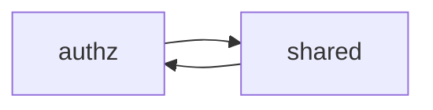
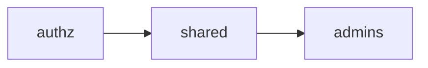

# circular-import

**Summary**: Avoid circular imports

**Category**: Imports

**Avoid**



```rego
# authz.rego
package authz

import data.shared

admins := {
    "anna",
    "bob",
}

allow if {
    input.role in shared.roles
}

allow if {
    input.user in admins
}
```

```rego
# shared.rego
package shared

import data.authz # circular import!

roles := { "admin", "editor", "viewer" }

users := authz.admins | {
    "chloe",
    "dave",
}
```

**Prefer**

Break out shared rules into a tree-like structure of packages. For example, one way we could refactor the above example
is to move the `admins` set into a new package.



```rego
# authz.rego
package authz

import data.shared

allow if {
    input.role in shared.roles
}

allow if {
    input.user in shared.users
}
```

```rego
# admins.rego
package admins

admins := {
    "anna",
    "bob",
}
```

```rego
# shared.rego
package shared

import data.admins

roles := {"admin", "editor", "viewer"}

users := admins.admins | {
    "chloe",
    "david",
}
```

## Rationale

A circular import is when a package imports itself, either by directly importing itself,
or indirectly by importing a which in turn imports a series of packages that eventually import the original package.

As long as recursive rules definitions are avoided, circular imports are permitted in Rego.
However, such import graphs are not advisable and a signal of poorly structured policy code.

If you have a circular import,
it's recommended that you refactor your code into different packages that do not import each other.
This will make your code easier to navigate and maintain.

## Configuration Options

This linter rule provides the following configuration options:

```yaml
rules:
  imports:
    circular-import:
      # one of "error", "warning", "ignore"
      level: error
```

## Related Resources

- GitHub: [Source Code](https://github.com/open-policy-agent/regal/blob/main/bundle/regal/rules/imports/circular-import/circular_import.rego)
