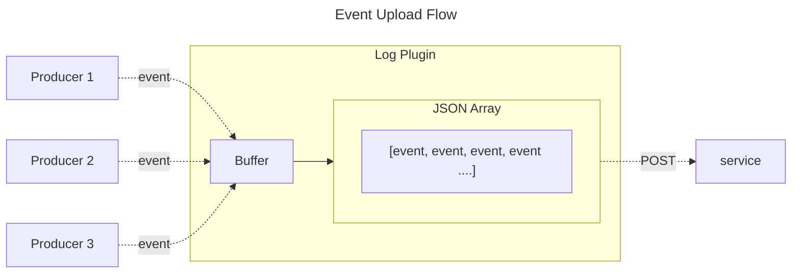
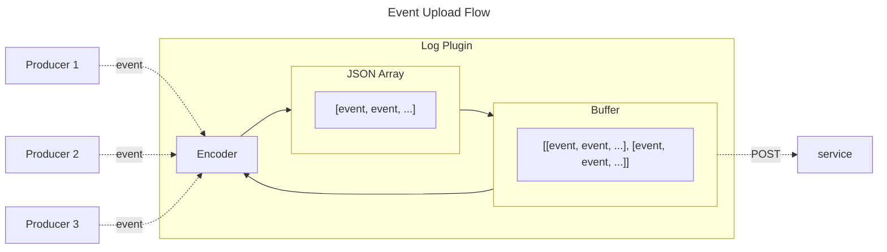

# Decision Log Plugin

The decision log plugin is responsible for gathering decision events from multiple sources and upload them to a service.
[This plugin is highly configurable](https://www.openpolicyagent.org/docs/latest/configuration/#decision-logs), allowing 
the user to decide when to upload, drop or proxy a logged event. Each configuration can be dynamically updated while OPA is running.

Events are uploaded in gzip compressed JSON array's at a user defined interval. This can either be triggered periodically
or manually through the SDK. The size of the gzip compressed JSON array is limited by `upload_size_limit_bytes`.

## Buffer Type

There are two buffer implementations that can be selected by setting `decision_logs.reporting.buffer_type`, defaults to `size`

### Event Buffer

* `decision_logs.reporting.buffer_type=event`

As events are logged each event is encoded and saved in a buffer. When an upload is triggered, all the events currently
in the buffer are uploaded in chunks (limited by `upload_size_limit_bytes`). The oldest events will drop if the buffer
is full, the limit can be configured by changing `buffer_size_limit_events`.

Pros:
* Compressing only on upload keeps the event and JSON array buffers separate so they don't have to be in sync.
* Individual events can be dropped quicker without having to decompress the events.
* Using a channel as a buffer allows events to be written to the buffer concurrently.

Cons:
* Upload will be slower as the events need to be compressed.
* A buffer limit has to be set, unlimited size isn't allowed.

### Size Buffer

* `decision_logs.reporting.buffer_type=size`

As events are logged they are encoded and compressed into a JSON Array before being added to the buffer. When an upload 
is triggered the current buffer is emptied, uploading each JSON Array of events as chunks. By default, the buffer is an
unlimited size but if `buffer_size_limit_bytes` is configured the oldest events will be dropped.

Pros:
* Uploads are quicker because each event is already encoded and compressed.
* The local memory in bytes of the buffer can be limited.

Cons:
* Events can flow between the encoder and buffer requiring a heavy use of locks.
* Dropping an individual event requires decompressing an entire array of events.
* Adding events to the buffer is slower as compression happens on write.

## Triggers

There are three trigger options that can be selected by setting `decision_logs.reporting.trigger`, defaults to
`periodic`.

### Periodic (default)

Uploads are delayed by a number of seconds randomly selected between a minimum and maximum. The default delay
range is 300-600 seconds, this can be configured by setting `decision_logs.reporting.min_delay_seconds` and
`decision_logs.reporting.max_delay_seconds`. When the upload is triggered multiple chunks will be uploaded one at a
time.

It is recommended to use this trigger mode to prevent overloading the service with upload requests.

### Immediate

As soon as enough events are received to create a chunk the plugin will trigger an upload (when a chunk is ready is
determined by `upload_size_limit_bytes`). Similar to the `periodic` mode the `min_delay_seconds` and `max_delay_seconds`
can still be configured. Instead, this timer is used to flush the encoder buffer in case not enough events are received
to create a chunk. The timer is reset if a chunk is uploaded, this helps to ensure chunks are closer to the upload limit
before upload.

if the buffer fills up the contents could upload before `min_delay_seconds`.

It is recommended to use this trigger mode if you want a constant stream of incoming data.

### Manual

This option can only be used when using OPA as a Go package. The OPA Go package exposes as method
called [Plugin.Trigger](https://pkg.go.dev/github.com/open-policy-agent/opa@v1.3.0/v1/plugins/logs#Plugin.Trigger)
that can be called to trigger an upload.

## Glossary

* `Chunk`: gzip compressed JSON array of decision events, size limited by the upload limit
* `Encoder`: A buffer that creates a single chunk
* `Size Buffer`: A buffer that holds multiple chunks
* `Event Buffer`: A buffer that holds events or failed uploaded chunks